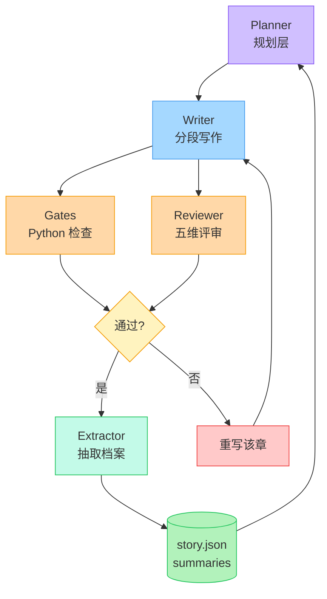

# novel-engine 开发规格（v1）

| 段    | 内容                                                  |
| ----- | ----------------------------------------------------- |
| **1** | 总体架构 · 数据模型 · 落盘与不变量                    |
| 2     | 模块总表 · M1–M6（基础设施 / 记忆 / 上下文组装）      |
| 3     | M7–M12（LLM / 规划 / 写作 / Gates / 评审 / Engine）   |
| 4     | M13–M18（Arbiter / 压缩 / 反馈 / CLI / Server / Web） |

---

## 1. 总体架构

一句话定位：**一套把"写一本几十万字的书"拆成"可枚举的状态迁移 + 少量语义裁定 + 开放式生成"的 headless 引擎**，CLI 与 Web 只是它的两个壳。

### 1.1 主流水线



### 1.2 三条分层原则

| 原则       | 含义                                            | 对应模块 |
| ---------- | ----------------------------------------------- | -------- |
| 事实层确定 | 正文、设定、大纲以文件为唯一真相，JSON 只存索引 | M3 / M4  |
| 语义层自主 | 只有真正需要判断的地方才调 LLM                  | M7 / M13 |
| 状态可回放 | 每次迁移落 checkpoint，崩了按 store 续跑        | M12      |

前端那侧的边界：`core` 全程 headless，**不 import 任何 React / CLI 库**。Web 只通过 HTTP + SSE 跟 server 说话，跟 core 零直接依赖——这样你后面换框架不动引擎。

## 2. 数据模型

`packages/core/src/types.ts`，一次给全：

```ts
// ---- 设定层 ----
export interface Premise {
    logline: string;
    themes: string[];
    tone: string;
}
export interface Compass {
    ending: string;
    mainThreads: string[];
    scale: { volumes: number; chapters: number };
    revision: number;
}
export interface CharacterSnapshot {
    id: string;
    name: string;
    aliases: string[];
    role: string;
    realm: string;
    location: string;
    knows: string[];
    ignores: string[]; // 信息边界，悬念的来源
    relations: { to: string; kind: string }[];
}
export interface Foreshadow {
    id: string;
    content: string;
    plantedChapter: number;
    targetChapter?: number;
    status: 'open' | 'paid' | 'overdue';
}
export interface ChapterIndexEntry {
    id: string;
    order: number;
    volumeId: string;
    arcId: string;
    words: number;
    contentHash: string;
    status: 'draft' | 'checked' | 'locked';
    gateStatus: 'pass' | 'warn' | 'fail' | 'pending';
    summaryPath: string;
}
export interface StoryIndex {
    schemaVersion: number;
    characters: CharacterSnapshot[];
    foreshadows: Foreshadow[];
    index: ChapterIndexEntry[];
    updatedAt: string;
}

// ---- 蓝图 ----
export interface ChapterBlueprint {
    id: string;
    order: number;
    volumeId: string;
    arcId: string;
    goal: string;
    cast: string[];
    beats: string[];
    paysOff: string[];
    plants: string[];
    payoffLevel: 'none' | 'small' | 'medium' | 'large';
    hookType: 'suspense' | 'reversal' | 'emotion' | 'reveal';
    pacing: 'slow' | 'normal' | 'fast';
    targetWords: number;
}

// ---- 运行态 ----
export interface RunState {
    bookId: string;
    phase: 'init' | 'premise' | 'outline' | 'writing' | 'complete';
    flow: 'idle' | 'writing' | 'reviewing' | 'rewriting' | 'polishing' | 'steering';
    activeChapterId?: string;
    lastCheckpoint: string;
    counters: { chaptersWritten: number; rewrites: number; llmCalls: number; tokensIn: number; tokensOut: number };
    startedAt: string;
    updatedAt: string;
}
export interface Checkpoint {
    id: string;
    createdAt: string;
    phase: RunState['phase'];
    flow: RunState['flow'];
    activeChapterId?: string;
    storyIndexHash: string;
    artifactPaths: string[];
    note: string;
}

// ---- 结果与产出 ----
export interface ExtractionResult {
    summary: string;
    characterUpdates: { id: string; changed: Partial<CharacterSnapshot>; cause: string }[];
    newForeshadows: { content: string; targetChapter?: number }[];
    paidForeshadows: { id: string; how: string }[];
    timelineEvents: { storyTime: string; event: string; participants: string[]; irreversible: boolean }[];
}
export interface ChapterDraft {
    chapterId: string;
    segments: { index: number; text: string; targetWords: number; actualWords: number }[];
    words: number;
    contentHash: string;
    assembledAt: string;
}
export interface GateResult {
    gate: string;
    severity: 'info' | 'warn' | 'error';
    status: 'pass' | 'warn' | 'fail';
    messages: { code: string; message: string; location?: string }[];
    raw?: string;
    durationMs: number;
}
export interface FeedbackRecord {
    chapterId: string;
    source: 'human' | 'reviewer' | 'gate';
    metric: string;
    value: number | string;
    note: string;
    at: string;
}

// ---- 基础设施 ----
export interface Config {
    root: string;
    llm: { baseUrl: string; apiKey: string; model: string; temperature: number; maxTokens: number; timeoutMs: number };
    agents: Record<string, { temperature?: number; model?: string }>;
    memory: { shortWindow: number; retrieveK: number; compressAtPct: number };
    logLevel: 'debug' | 'info' | 'warn' | 'error';
}
export interface LLMResponse {
    text: string;
    usage: { in: number; out: number };
    model: string;
    latencyMs: number;
    fromCache?: boolean;
}
export interface PromptBundle {
    blocks: { seq: number; kind: 'system' | 'data' | 'instruction'; label: string; text: string; tokens: number }[];
    totalTokens: number;
}
export interface SegmentPlan {
    index: number;
    targetWords: number;
    brief: string;
}
export interface RetrievedBlock {
    kind: 'foreshadow' | 'appearance' | 'stateChange' | 'relation';
    ref: string;
    text: string;
    score: number;
}
```

## 3. 落盘与不变量

### 3.1 目录

```text
content/                    # 事实层，人能读、能改
  book/compass.md
  book/characters/*.md
  outline/vol-01.md
  outline/arc-v01-a01.md    # 含各章蓝图
  chapters/vol-01/ch-0001.md
  summaries/ch-0001.md
  anchors/style.md
  skills/**                 # 从旧仓 assets/skills/* 迁来
state/                      # 状态层，机器读写
  story.json  run.json  journal.jsonl
  checkpoints/cp-0007.json
  prompts/  decisions/  gates/  feedback/  llm/
gates/                      # Python 检查器
tools/                      # 通用 Python 工具
```

### 3.2 谁写哪个文件

| 文件                     | 谁写                      | 备注                       |
| ------------------------ | ------------------------- | -------------------------- |
| `book/compass.md`        | 人类为主，M8.8 卷边界微调 | 带 frontmatter             |
| `chapters/**/*.md`       | M9                        | 原子写，正文 + frontmatter |
| `summaries/*.md`         | M5                        | 章节进 locked 前必须有     |
| `state/story.json`       | M4                        | 正文不入 JSON              |
| `state/prompts/*.txt`    | M6                        | 全文落盘，可复盘           |
| `state/gates/*.json`     | M10                       | 每轮留档                   |
| `state/feedback/*.jsonl` | M15                       | 追加型                     |

### 3.3 不变量（断言，也是回归测试）

| 编号 | 不变量                                                                                   |
| ---- | ---------------------------------------------------------------------------------------- |
| I1   | `index` 每项在 `chapters/` 下有对应 md；反向也成立                                       |
| I2   | 章节进 `locked` 前，`summaries/` 必须有对应档案                                          |
| I3   | `status=open` 且 `targetChapter < 当前章` 的伏笔，下一章蓝图须标记回收，或升级 `overdue` |
| I4   | `RunState.phase` 单调不回退                                                              |
| I5   | 每个 checkpoint 的 `storyIndexHash` 对得上当时的 `story.json`                            |
| I6   | 正文 `contentHash` 与内容一致，作为幂等键                                                |

### 1.3 剩余类型（接上段）

```ts
export interface LLMResponse {
    text: string;
    usage: { in: number; out: number };
    model: string;
    latencyMs: number;
    raw?: unknown;
}
export interface PromptBundle {
    blocks: { seq: number; kind: 'system' | 'data' | 'instruction'; name: string; text: string; tokens: number }[];
    totalTokens: number;
    truncated: string[];
}
export interface GateSpec {
    name: string;
    script: string;
    timeoutMs: number;
    severity: 'info' | 'warn' | 'error';
}
export interface SegmentPlan {
    index: number;
    targetWords: number;
    beats: string[];
    isLast: boolean;
}
```

这里有个给前端留的口子：**这些类型全走 `state/` 的 JSON 和 HTTP 返回，所以不能出现 `Date`、`Map`、`Set`**。时间一律 ISO 字符串，字典一律 `Record<K, V>`。你在 `apps/web` 里想直接用这些类型当 API DTO，就靠这条约束成立。

### 1.4 落盘格式

| 路径                                   | 谁写            | 说明                                                 |
| -------------------------------------- | --------------- | ---------------------------------------------------- |
| `content/book/compass.md`              | 人类为主        | frontmatter: ending / mainThreads / scale / revision |
| `content/book/characters/*.md`         | M8 生成，人可改 | frontmatter: id / aliases / realm                    |
| `content/outline/vol-*.md`、`arc-*.md` | M8              | 蓝图正文 + 章节 frontmatter                          |
| `content/chapters/vol-XX/ch-XXXX.md`   | M9              | 纯正文 + frontmatter                                 |
| `content/summaries/ch-XXXX.md`         | M5              | 人可读档案                                           |
| `state/story.json`                     | M4              | 完整 `StoryIndex`，**正文不入**                      |
| `state/run.json`                       | M12             | `RunState`                                           |
| `state/checkpoints/cp-XXXX.json`       | M12             | 四位补零，不覆盖                                     |
| `state/prompts/ch-XXXX-sN.txt`         | M6              | 组装好的 prompt 全文                                 |
| `state/decisions/d-XXXX.json`          | M13             | Arbiter 每次裁定                                     |
| `state/llm/<ts>.json`                  | M7              | 请求 / 响应 / 耗时                                   |
| `state/gates/ch-XXXX.json`             | M10             | 检查结果留档                                         |
| `state/journal.jsonl`                  | M4              | 追加式，每次写状态记一条                             |
| `state/feedback/*.jsonl`               | M15             | 追加型指标流                                         |

### 1.5 不变量

这几条是全局验收判据，也是回归测试的断言：

| 编号 | 内容                                                                                           |
| ---- | ---------------------------------------------------------------------------------------------- |
| I1   | `story.json.index` 每项都在 `content/chapters/` 下有对应 md，反向也成立                        |
| I2   | 章节进 `locked` 前，`summaries/` 下必须有对应档案                                              |
| I3   | `status=open` 且 `targetChapter < 当前章` 的伏笔，必须在下一章蓝图标记回收，或升级为 `overdue` |
| I4   | `RunState.phase` 单调不回退                                                                    |
| I5   | 每个 checkpoint 的 `storyIndexHash` 能对上当时的 `story.json`                                  |
| I6   | 写正文时 `contentHash` 与内容一致，作为幂等键                                                  |

## 2. 模块总表

| 编号 | 模块              | 包          | 职责                      | 主要喂给               |
| ---- | ----------------- | ----------- | ------------------------- | ---------------------- |
| M1   | 契约层            | core        | 全部类型与不变量          | 全部                   |
| M2   | 配置与环境        | core        | env、路径、日志           | 全部                   |
| M3   | 事实层 IO         | core        | 读写 `content/`           | readState / writeState |
| M4   | 状态层 IO         | core        | 读写 `state/`、checkpoint | readState / writeState |
| M5   | Extractor         | core        | 章节 → 结构化档案         | writeState             |
| M6   | Context Assembler | core        | 拼装章节上下文            | **buildPrompt**        |
| M7   | LLM 层            | core        | 薄 HTTP 封装              | **callLLM**            |
| M8   | 规划层 Architect  | core        | 分层大纲 + 滚动展开       | buildPrompt / callLLM  |
| M9   | Writer            | core        | 分段生成正文              | buildPrompt / callLLM  |
| M10  | Gates 桥          | core        | 调 Python 检查器          | **runGates**           |
| M11  | Reviewer          | core        | LLM 五维评审              | callLLM                |
| M12  | Engine            | core        | 确定性状态机 + 断点恢复   | 全部                   |
| M13  | Arbiter           | core        | 单次 LLM 裁定             | callLLM                |
| M14  | 压缩管线          | core        | 四级压缩 + 恢复包         | buildPrompt            |
| M15  | 反馈记录          | core        | 指标落盘与回灌            | **recordFeedback**     |
| M16  | CLI               | apps/cli    | 终端外壳                  | 六函数                 |
| M17  | Server            | apps/server | HTTP + SSE 外壳           | 六函数                 |
| M18  | Web               | apps/web    | 浏览器 UI                 | 只走 HTTP / SSE        |

## 3. 各模块功能点

### M1 契约层

| 编号 | 功能                | 落点 / 签名                             | 验收                        |
| ---- | ------------------- | --------------------------------------- | --------------------------- |
| M1.1 | 全部 interface 定义 | `types.ts`                              | tsc 零错误，core 内统一引用 |
| M1.2 | 类型守卫            | `isValidStoryIndex(x): x is StoryIndex` | 坏数据返回 false            |
| M1.3 | schema 版本         | `SCHEMA_VERSION = 1`                    | 不匹配报错并提示迁移        |
| M1.4 | 迁移函数            | `migrate(raw, from, to)`                | v1 时恒等，先留接口         |
| M1.5 | 不变量断言          | `assertInvariants(s)`                   | I1–I3 可被单测触发          |
| M1.6 | 序列化约束          | 禁 `Date` / `Map` / `Set`               | lint 规则或单测扫描字段类型 |

### M2 配置与环境

| 编号 | 功能          | 落点 / 签名            | 验收                                        |
| ---- | ------------- | ---------------------- | ------------------------------------------- |
| M2.1 | 读 env        | `loadConfig(): Config` | 缺 `LLM_BASE_URL` / `LLM_API_KEY` 立刻 fail |
| M2.2 | 分 Agent 参数 | `config.agents[name]`  | 可单独覆盖 temperature / model              |
| M2.3 | 路径解析      | `paths.bookRoot` 等    | 支持 `NOVEL_ROOT` 覆盖，禁止散落拼路径      |
| M2.4 | 日志          | `log.level(level)`     | stdout 只放结构化结果，日志走 stderr        |

### M3 事实层 IO

| 编号  | 功能          | 落点 / 签名                             | 验收                                           |
| ----- | ------------- | --------------------------------------- | ---------------------------------------------- |
| M3.1  | 读 Compass    | `readCompass(): Compass`                | 解析 frontmatter                               |
| M3.2  | 读角色        | `readCharacters(): CharacterSnapshot[]` | 扫 `characters/*.md`                           |
| M3.3  | 读卷 / 弧     | `readOutline(): { volumes; arcs }`      | `outline/*.md`                                 |
| M3.4  | 读章节蓝图    | `readBlueprints(): ChapterBlueprint[]`  | 缺 `payoffLevel` / `hookType` 报错，不给默认值 |
| M3.5  | 读单章正文    | `readChapter(id)`                       | 正文与 frontmatter 分离解析                    |
| M3.6  | 写章节        | `writeChapter(id, text, fm)`            | **原子写**：写 `.tmp` 再 `rename`              |
| M3.7  | 读风格锚点    | `readAnchors(): string`                 | 文件不存在返回空串，不抛错                     |
| M3.8  | 读 skill 素材 | `readSkills(keys): string[]`            | 按需读，不整目录扫                             |
| M3.9  | 路径守卫      | `resolveSafe(root, rel)`                | `../../etc/passwd` 必须抛错                    |
| M3.10 | 目录初始化    | `ensureLayout(): void`                  | 幂等，已有目录不报错                           |
| M3.11 | 章节哈希      | `hashContent(text): string`             | sha256 前 16 位，同内容同哈希                  |

### M4 状态层 IO

| 编号  | 功能              | 落点 / 签名                              | 验收                                           |
| ----- | ----------------- | ---------------------------------------- | ---------------------------------------------- |
| M4.1  | 读状态            | `readState(): StoryIndex`                | 先过 `isValidStoryIndex`，坏数据定位到字段     |
| M4.2  | 写状态            | `writeState(s)`                          | 原子写 + 更新 `storyIndexHash`；写前跑不变量   |
| M4.3  | 读运行态          | `readRunState(): RunState`               | 文件不存在返回初始态（`phase=init`）           |
| M4.4  | 写运行态          | `writeRunState(r)`                       | phase / flow 变更后立刻落盘                    |
| M4.5  | 写 checkpoint     | `writeCheckpoint(cp)`                    | `cp-0007.json`，递增不覆盖                     |
| M4.6  | 取最新 checkpoint | `latestCheckpoint(): Checkpoint \| null` | 按 id 倒序，空目录返回 null                    |
| M4.7  | 恢复              | `restoreFrom(cp): RunState`              | 校验 `storyIndexHash` 对得上，否则拒绝         |
| M4.8  | 写锁              | `withLock(fn)`                           | `state/.lock` 文件锁，防 CLI 与 server 同写    |
| M4.9  | 状态备份          | `backupState()`                          | `state/backup/story-<ts>.json`，滚动保留 20 份 |
| M4.10 | 增量日志          | `appendJournal(entry)`                   | 每次 writeState 记 `{ts, op, chapterId, hash}` |

---

### M4 状态层 IO（接上段）

| 编号  | 功能              | 落点 / 签名                              | 验收                                                         |
| ----- | ----------------- | ---------------------------------------- | ------------------------------------------------------------ |
| M4.4  | 写运行态          | `writeRunState(r)`                       | 每次 phase / flow 变更后立刻落盘                             |
| M4.5  | 写 checkpoint     | `writeCheckpoint(cp)`                    | `cp-0007.json` 四位补零，单调递增不覆盖                      |
| M4.6  | 取最新 checkpoint | `latestCheckpoint(): Checkpoint \| null` | 按 id 倒序；空目录返回 null                                  |
| M4.7  | 恢复              | `restoreFrom(cp): RunState`              | 校验 `storyIndexHash` 对得上，否则**拒绝恢复**               |
| M4.8  | 写锁              | `withLock(fn)`                           | `state/.lock` 文件锁，防 CLI 与 server 同时写一本书          |
| M4.9  | 状态备份          | `backupState()`                          | `state/backup/story-<ts>.json`，滚动保留最近 20 份           |
| M4.10 | 增量日志          | `appendJournal(entry)`                   | `state/journal.jsonl` 追加式，记 `{ts, op, chapterId, hash}` |

M4.7 那条「拒绝恢复」必须硬。checkpoint 里的 `storyIndexHash` 和当前 `story.json` 对不上，说明中间有人手工改了状态——这时候静默恢复会把你带进一个自相矛盾的世界。宁可停下让你人工确认。

M4.9 / M4.10 看着多余，是长任务的保险绳。跑到第 80 章发现状态被某个 bug 污染，没备份就只能从头；journal 让你事后查「第 37 章的状态是哪次操作改的」。

### M5 Extractor（章节 → 结构化档案）

整个系统最容易被低估的模块。它的输出质量直接决定第 20 章会不会吃书。

| 编号 | 功能         | 落点 / 签名                            | 验收                                                        |
| ---- | ------------ | -------------------------------------- | ----------------------------------------------------------- |
| M5.1 | 抽取入口     | `extract(chapterId): ExtractionResult` | 输入正文 + 当前 `StoryIndex` 的相关切片                     |
| M5.2 | 抽取 prompt  | `prompts/extract.md`                   | 输出严格 JSON，无 markdown 包裹                             |
| M5.3 | 输出结构     | `ExtractionResult`（见数据模型）       | 五个字段全必填，缺字段视为失败                              |
| M5.4 | 实体校验     | `validateExtraction(r, text)`          | 抽出的角色名必须真出现在正文里，否则丢该项并 warn（防幻觉） |
| M5.5 | 合并进状态   | `mergeExtraction(s, r): StoryIndex`    | **幂等**：同一章抽两次结果一致，不产生重复伏笔              |
| M5.6 | 写人可读档案 | `writeSummaryDigest(id, r)`            | `content/summaries/ch-0001.md`，人要一眼读懂                |
| M5.7 | 解析失败降级 | 内部重试 1 次 → 再失败标 `needsReview` | 不阻塞主循环，但该章不能进 `locked`                         |
| M5.8 | 抽取时机     | `draft` 之后、`commit` 之前            | 与 Gates 并行（见 M12）                                     |

M5.4 是关键防线。模型抽档案时会顺手编出「主角的师父」这种正文里根本没提的角色——不校验，这些幽灵就会进入状态库，然后被后续章节当成真的引用。校验规则很土：抽取出的 `name` / `aliases` 只要在正文里找不到字面命中，就丢掉。

### M6 Context Assembler（拼装章节上下文）

`buildPrompt` 的实现体。**所有决定章节质量的内容约束都在这里**——你之前「改 prompt 改不出质量」，根因就是这个模块没被拆成显式结构，约束全散在一段散文里，模型可以无视。

| 编号  | 功能           | 落点 / 签名                               | 验收                                      |
| ----- | -------------- | ----------------------------------------- | ----------------------------------------- |
| M6.1  | 固定组装顺序   | `buildPrompt(id, segment?): PromptBundle` | 顺序见下表；块缺失记 warn 但不崩          |
| M6.2  | token 预算     | `TokenBudget` 常量表                      | 超预算按优先级裁剪                        |
| M6.3  | 滑窗摘要       | `recentDigests(k)`                        | 默认最近 3 章，从 `summaries/` 读         |
| M6.4  | 角色快照注入   | `relevantSnapshots(cast)`                 | 只注入本章出场角色 + 其直接关系人         |
| M6.5  | 伏笔注入       | `openForeshadows(arcId)`                  | 本章 `paysOff` 的 + 当前弧未回收的        |
| M6.6  | 四维反查       | `retrieve(chapterId): RetrievedBlock[]`   | 伏笔 / 出场 / 状态变化 / 关系，各取 top-k |
| M6.7  | 上一章末段原文 | `prevChapterTail(500)`                    | 衔接语气用，只取原文最后 500 字           |
| M6.8  | 分段 prompt    | 每段带自己的 `targetWords`                | 段 2+ 必须含前段收尾 200 字               |
| M6.9  | 落盘 prompt    | `state/prompts/ch-0001-s1.txt`            | 全文落盘，事后可复盘「当时到底喂了什么」  |
| M6.10 | 内容隔离       | `wrapAsData(chunk)`                       | 正文 / 素材一律包成 data 区，防注入       |
| M6.11 | 中文估算       | `estimateTokens(t) = runes × 1.5`         | 超预算 10% 触发裁剪                       |

**组装顺序与预算**（这张表就是 `buildPrompt` 的规格）：

| 序  | 块                  | 预算(tokens) | 来源                          | 裁剪优先级   |
| --- | ------------------- | ------------ | ----------------------------- | ------------ |
| 1   | 写作规范 system     | 800          | `content/skills/writing-*.md` | 不裁         |
| 2   | 风格锚点            | 600          | `anchors/style.md`            | 最后裁       |
| 3   | Compass             | 300          | `compass.md`                  | 不裁         |
| 4   | 本章蓝图            | 400          | `outline/arc-*.md`            | 不裁         |
| 5   | 角色快照            | 1200         | `story.json.characters`       | 先裁关系细节 |
| 6   | 前情摘要（滑窗3章） | 2000         | `summaries/`                  | 按章压缩     |
| 7   | 四维反查            | 1500         | M6.6                          | 减 k         |
| 8   | 上一章末段          | 500          | 正文文件                      | 可裁         |
| 9   | 输出预留            | 3000         | —                             | —            |

拼出来的 prompt 长这样，九块，顺序固定：

```text
[1] system  写作规范（每段推进一件事；禁用词表；标点规则）
[2] system  风格锚点（语气样本，明确标注"只学腔调，不学内容"）
[3] data    全书指南针（终局方向 + 活跃长线 + 规模估计）
[4] data    本章蓝图（goal / beats / payout / hook / pacing）
[5] data    出场角色快照（当前境界、所在地、信息边界）
[6] data    前情摘要（最近 3 章档案，倒序）
[7] data    四维反查（伏笔 / 出场 / 状态变化 / 关系）
[8] data    上一章末段原文（500 字）
[9] instruction  本段任务（第 n/m 段，targetWords=1500，收尾要求）
```

第 5 块里的**信息边界**（`knows` / `ignores`）值得单拎：每个角色「不知道什么」和「知道什么」一样重要。主角不知道反派身份，悬念才成立；你把全书设定一股脑喂进去，模型会写出「主角仿佛早有预感」这种穿帮。

### M7 LLM 层

| 编号  | 功能          | 落点 / 签名                                                     | 验收                                 |
| ----- | ------------- | --------------------------------------------------------------- | ------------------------------------ |
| M7.1  | 统一入口      | `callLLM(req): Promise<LLMResponse>`                            | core 内唯一发 HTTP 的地方            |
| M7.2  | 请求体        | `{ system, messages, temperature, maxTokens, model, jsonMode }` | 换厂商只改 env                       |
| M7.3  | 流式          | `callLLMStream(req): AsyncIterable<string>`                     | 逐 token 回调，供 CLI 实时打印       |
| M7.4  | 超时          | `AbortController` + `timeoutMs`                                 | 超时抛 `LLMTimeoutError`，可区分     |
| M7.5  | 重试          | 429 / 5xx 重试；**4xx 直接抛**                                  | 指数退避 + jitter，默认 3 次         |
| M7.6  | JSON 模式     | `jsonMode: true`，解析失败重试一次                              | 返回前 `JSON.parse`，失败带原文抛错  |
| M7.7  | 用量统计      | 累计 tokensIn / tokensOut                                       | 写回 `RunState.counters`             |
| M7.8  | 调用落盘      | `state/llm/<ts>.json`                                           | 记 request / response / 耗时，可回放 |
| M7.9  | 分 Agent 参数 | 按 `agentName` 覆盖                                             | 评审用低温，写作可高温               |
| M7.10 | 熔断          | 连续 N 次失败 → `CircuitOpenError`                              | 防失败风暴烧光额度                   |
| M7.11 | 无共享状态    | 每次请求自包含                                                  | 并发调用互不污染                     |

M7.5 那条「4xx 不重试」是省钱的关键。401 是 key 错了，重试十次还是 401，白等还占着主循环。

### M8 规划层 Architect

| 编号 | 功能           | 落点 / 签名                      | 验收                                  |
| ---- | -------------- | -------------------------------- | ------------------------------------- |
| M8.1 | 生成前提       | `generatePremise(seed): Premise` | 输出 `premise.md` + 2 个备选          |
| M8.2 | 生成指南针     | `generateCompass(p): Compass`    | 含 ending / mainThreads / scale       |
| M8.3 | 生成角色       | `generateCharacters(p)`          | 每人一张 md + `story.json` 条目       |
| M8.4 | 展开卷         | `expandVolume(volId)`            | **只展开下一卷**，不碰全书            |
| M8.5 | 展开弧         | `expandArc(volId)`               | 含弧目标 + 章节数估计                 |
| M8.6 | 生成章节蓝图   | `generateBlueprints(arcId)`      | 每章必须带 `payoffLevel` / `hookType` |
| M8.7 | 大纲自检       | `validateOutline()`              | 蓝图引用的角色 / 伏笔必须在状态库存在 |
| M8.8 | 卷边界修指南针 | `reviseCompass()`                | 只在卷边界调用，`revision + 1`        |

M8.4 一次只展开一卷，这点容易写错。你 300 章的书，如果 `init` 阶段就展开到第 20 卷，第 15 卷的蓝图必然是空的——那时候模型手上一堆远期设定、没有刚写出的正文作依据，只能编。滚动展开的顺序永远是：写完一卷 → 读它的摘要和角色快照 → 再展开下一卷。

`ChapterBlueprint` 的 `payoffLevel` / `hookType` / `pacing` 是**必填枚举**，不给默认值。这些约束一旦落进结构，M11 才有东西可验、M10 才有东西可拦。

### M9 Writer

| 编号 | 功能     | 落点 / 签名                             | 验收                                |
| ---- | -------- | --------------------------------------- | ----------------------------------- |
| M9.1 | 章节入口 | `writeChapter(id): ChapterDraft`        | 读蓝图 → 分段 → 生成 → 拼接         |
| M9.2 | 分段计划 | `planSegments(bp): SegmentPlan[]`       | 按 `targetWords` 拆，单段 ≤ 2000 字 |
| M9.3 | 段循环   | **顺序**生成，不并行                    | 段 N 依赖段 N-1 的收尾              |
| M9.4 | 衔接     | 段 2+ 注入前段末 200 字                 | 防段间语气断裂                      |
| M9.5 | 字数控制 | 每段带自己 `targetWords`                | 偏离 > 30% 记 warn                  |
| M9.6 | 幂等     | 以 `contentHash` 为键                   | 同键重复调用直接返回已有结果        |
| M9.7 | 拼接     | `assembleSegments(segs)`                | 去段间重复句式，**不加分隔符**      |
| M9.8 | 落盘     | 写 `content/chapters/vol-XX/ch-XXXX.md` | 原子写，正文 + frontmatter          |
| M9.9 | 不写状态 | Writer 只产草稿                         | 状态由 M5 + M12 提交                |

从 M8.4 接上。

---

### M8 规划层 Architect（接上段）

| 编号 | 功能           | 落点 / 签名                                     | 验收                                             |
| ---- | -------------- | ----------------------------------------------- | ------------------------------------------------ |
| M8.4 | 展开卷         | `expandVolume(volId): VolumeOutline`            | **一次只展一卷**，不碰全书                       |
| M8.5 | 展开弧         | `expandArc(volId): ArcOutline`                  | 含弧目标 + 章节数估计                            |
| M8.6 | 生成章节蓝图   | `generateBlueprints(arcId): ChapterBlueprint[]` | 每章必带 `payoffLevel` / `hookType`（类型见 §2） |
| M8.7 | 大纲自检       | `validateOutline(): Problem[]`                  | 蓝图引用的角色 / 伏笔必须在状态库存在            |
| M8.8 | 卷边界修指南针 | `reviseCompass(): Compass`                      | 只在卷边界调用，`revision +1`                    |
| M8.9 | 远卷占位       | `stubFutureVolumes(): void`                     | 远卷只写一行标题，**禁止**生成空壳蓝图           |

M8.4 是这里最容易写错的地方。300 章的书，如果 init 阶段就展开到第 20 卷，第 15 卷的蓝图必然是空的——模型手上一堆远期设定，没有刚写出来的正文作依据，只能编。滚动展开的顺序永远是：写完一卷 → 读它的档案 + 角色快照 → 再展开下一卷。M8.9 是配套的：远卷先留个标题占位，别让 `validateOutline` 以为大纲已齐。

那三个枚举字段（`payoffLevel` / `hookType` / `pacing`）是必填的。你之前「改 prompt 改不出质量」，就是这个原因——约束当时散在某段散文 prompt 里，模型可以无视；变成蓝图字段之后，M11 才有东西可验，M12 才有东西可拦。

### M9 Writer

| 编号 | 功能     | 落点 / 签名                             | 验收                                |
| ---- | -------- | --------------------------------------- | ----------------------------------- |
| M9.1 | 章节入口 | `writeChapter(id): ChapterDraft`        | 读蓝图 → 分段 → 生成 → 拼接         |
| M9.2 | 分段计划 | `planSegments(bp): SegmentPlan[]`       | 按 `targetWords` 拆，单段 ≤ 2000 字 |
| M9.3 | 段循环   | **顺序**生成，不并行                    | 段 N 的 prompt 依赖段 N-1 的收尾    |
| M9.4 | 衔接     | 段 2+ 注入前段末 200 字                 | 防段间语气断裂                      |
| M9.5 | 字数控制 | 每段带自己的 `targetWords`              | 实际偏离 > 30% 记 warn              |
| M9.6 | 幂等     | 以 `contentHash` 为键                   | 同键重复调用直接返回已有结果        |
| M9.7 | 拼接     | `assembleSegments(segs): string`        | 去段间重复句式，**不加分隔符**      |
| M9.8 | 落盘     | 写 `content/chapters/vol-XX/ch-XXXX.md` | 原子写，正文 + frontmatter          |
| M9.9 | 不写状态 | Writer 只产草稿                         | 状态由 M5 + M12 提交                |

M9.3 的顺序性是硬约束。并行能省一半时间，但段 2 不知道段 1 最后停在哪，读起来必然像两篇拼的。你之前那三章「能结束了还补一段修饰」，一半原因就是段末没有明确的收尾指令——所以每段的 instruction 里必须写清「本段是第 n/m 段，若是末段则收在冲突点上，不做总结」。

### M10 Gates 桥（你当前的阻塞点）

Gates 是流水线末端的质检工：只拿尺子量，不负责改。接口要窄到只有一句话——**给一个 md 文件，回一个 JSON**。这样旧仓 `scripts/` 下的 Python 检查器几乎不用动，加一层 CLI 包装就迁过来了。

协议定死：

```text
argv[1]   : 待检章节 md 的路径
stdout    : 单个 JSON 对象（GateResult 的 payload）
stderr    : 人类可读诊断，随便打
exit 0    : pass
exit 1    : fail（内容有问题）
exit 其他 : 脚本自己崩了，与内容无关
```

| 编号   | 功能         | 落点 / 签名                                        | 验收                                   |
| ------ | ------------ | -------------------------------------------------- | -------------------------------------- |
| M10.1  | 单检查器     | `runGate(name, file): Promise<GateResult>`         | spawn `python3`，超时 30s              |
| M10.2  | 全量跑       | `runGates(chapterId): GateResult[]`                | 并发跑所有注册检查器                   |
| M10.3  | 注册表       | `gates/registry.ts`（name → 脚本 / 超时 / 严重级） | 新增检查器只改这里                     |
| M10.4  | stdout 解析  | 严格 `JSON.parse`                                  | 非 JSON → `status:"warn"` + 原始 `raw` |
| M10.5  | exit 映射    | 0→pass，1→fail，**其他→warn**                      | exit 2 是脚本崩，不是小说错            |
| M10.6  | 超时         | kill 整个进程树                                    | 防 Python 卡死拖垮主循环               |
| M10.7  | 严重级       | `error` 阻断 commit，`warn` 只记录                 | 谁裁决见 M12.4                         |
| M10.8  | 结果落盘     | `state/gates/ch-XXXX.json`                         | 每轮留档，可跨版本对比                 |
| M10.9  | 迁移         | 旧仓 `scripts/*.py` → `gates/*.py`                 | 统一成上面那套 argv / stdout / exit    |
| M10.10 | **类型回改** | `GateResult` 按真实 stdout 定型                    | 必须先接一只真检查器再定型             |

这轮把评审和主循环一次给完，中间不夹问题。

---

### M11 Reviewer（五维评审）

Gates 管机械规则，Reviewer 管审美判断。两者的检查范围必须**不重叠**——同一件事被两个模块验，你会拿到两份互相矛盾的结论，然后不知道该信谁。

| 编号   | 功能          | 落点 / 签名                                | 验收                                   |
| ------ | ------------- | ------------------------------------------ | -------------------------------------- |
| M11.1  | 评审入口      | `review(draft, bp): Promise<ReviewResult>` | 输入 = 正文 + 该章蓝图，输出结构化评分 |
| M11.2  | 五维打分      | 每维 1–5 分 + 一句理由                     | 缺任一维度视为评审失败，不补默认分     |
| M11.3  | 硬伤判定      | 硬伤优先于分数                             | 有硬伤直接 fail，不看均分              |
| M11.4  | 定位式意见    | `{ quote, problem, fix }[]`                | 每条意见必须带原文片段，否则丢弃       |
| M11.5  | 与 Gates 分工 | 机械规则 vs 审美判断                       | 两条流水线不检同一项                   |
| M11.6  | 严格 JSON     | `jsonMode: true`，失败重试 1 次            | 解析失败带原文抛错                     |
| M11.7  | 上下文裁剪    | 只喂蓝图 + 正文 + 出场角色快照             | **不喂**全书摘要，防被前情带偏         |
| M11.8  | 触发重写      | 任一维 ≤ 2，或存在硬伤                     | 阈值集中在一个常量文件                 |
| M11.9  | 分 Agent 参数 | `agents.reviewer.temperature = 0.2`        | 评审要稳定，不能有创造性               |
| M11.10 | 复审范围      | 只复审 fail 的维度                         | 不让已过的维度反复翻案                 |
| M11.11 | 落盘          | `state/feedback/review-*.jsonl`（追加）    | 供 M15 聚合，也是你调阈值的依据        |

**五个维度**，每个都对着一个具体的失败长相：

| 维度 | 判什么           | 典型失败                         |
| ---- | ---------------- | -------------------------------- |
| 结构 | 蓝图契约是否落实 | beats 漏了大半，goal 没达成      |
| 角色 | 人设与信息边界   | 角色说了他这章还不该知道的事     |
| 节奏 | 爽点与钩子       | 全章匀速，章末停在"于是众人散去" |
| 文笔 | 句子与描写密度   | 连续五段无事件推进，纯环境描写   |
| 伏笔 | 埋与收的闭环     | 蓝图标了 `paysOff`，正文没兑现   |

M11.7 那条「不喂全书摘要」是反直觉的，但必要。你把前情一股脑塞给评审，它会开始评「这一章和全书基调搭不搭」——那是 M8 的活。评审只该回答一个问题：这一章自己站得住吗？

### M12 Engine（主循环 + 断点恢复）

前面十一个模块都是零件，Engine 是把它们装成一条会跑、会停、能续的线。它**不新增对外函数**——core 的六个函数还是那六个，Engine 是内部的编排者。

| 编号   | 功能       | 落点 / 签名                                                           | 验收                                                      |
| ------ | ---------- | --------------------------------------------------------------------- | --------------------------------------------------------- |
| M12.1  | 主循环     | `run(bookId): Promise<void>`                                          | 一直跑到 `phase=complete` 或撞上闸门                      |
| M12.2  | Phase 单调 | `init→premise→outline→writing→complete`                               | 任何回退请求直接抛错（I4）                                |
| M12.3  | Flow 切换  | 六态：`idle / writing / reviewing / rewriting / polishing / steering` | 每次切换写 `run.json`                                     |
| M12.4  | 一章的周期 | draft → Gates ∥ Review → 判定 → Extract → Commit                      | Gates 与 Review **并行**，省一半时间                      |
| M12.5  | 提交闸门   | `commit(chapterId)`                                                   | Gates `error` 或 Review fail → 拒绝提交                   |
| M12.6  | 重写预算   | 同章最多重写 2 次                                                     | 超限标 `needsReview`，**停下等人**，不静默放行            |
| M12.7  | Checkpoint | 每次 commit 后写一份                                                  | 记 `phase / flow / activeChapterId / storyIndexHash`      |
| M12.8  | 恢复       | `resume(bookId)`                                                      | 从 `latestCheckpoint` 起，哈希不符拒绝恢复（M4.7）        |
| M12.9  | 卷边界动作 | 一卷写完 → `reviseCompass` + `expandVolume`                           | 顺序不可反，先改指南针再展下一卷                          |
| M12.10 | Steering   | `steer(instruction)` 插队指令                                         | 落 `state/decisions/`，只在段边界生效，不打断正在生成的段 |
| M12.11 | 事件流     | `emit(event)`                                                         | 见下表；CLI 打印、Server 转 SSE 都订阅它                  |
| M12.12 | 幂等       | 重复 `resume` 不重复写                                                | 以 `contentHash` 为键去重                                 |

**Phase 与 Flow 的合法组合**（这张表就是状态机的规格，`assertTransition` 照它实现）：

| Phase      | 允许的 Flow                                                     |
| ---------- | --------------------------------------------------------------- |
| `init`     | `idle`                                                          |
| `premise`  | `idle`                                                          |
| `outline`  | `idle`                                                          |
| `writing`  | `idle / writing / reviewing / rewriting / polishing / steering` |
| `complete` | `idle`                                                          |

只有 `writing` 期才允许那六种 flow 乱切。你在 `outline` 期想把 flow 设成 `rewriting`，直接抛错——这条约束能挡掉一大类「状态被某处代码意外改写」的 bug。

**对外事件**（Web 端只认这一串，不用轮询）：

| 事件                 | 时机                | 前端要做的             |
| -------------------- | ------------------- | ---------------------- |
| `chapter.started`    | 开始写某章          | 进度条推到该章         |
| `segment.ready`      | 单段生成完          | 流式追加正文预览       |
| `gates.done`         | 检查器全跑完        | 显示 warn / fail 列表  |
| `review.done`        | 评审出分            | 展示五维雷达           |
| `chapter.committed`  | 该章进 `locked`     | 刷新 `story.json` 视图 |
| `checkpoint.written` | 落盘一份 checkpoint | 更新时间轴             |
| `error`              | 撞闸门 / 熔断       | 弹人工介入提示         |

M12.6 的「停下等人」和 M10.5 的「其他 exit 码算 warn」是同一个取向：**宁可停下来问你，也不替你做决定**。自动重写两次还是不过，说明问题在蓝图或设定层，再重写十次也是烧钱。这时候 `phase` 停在 `writing`、`flow` 停在 `idle`，`run.json` 里那句 `needsReview` 就是给你看的路标。

最后一段，M13 到 M18 一次给完。

---

### M13 Arbiter（单次裁定）

Engine 能枚举的自己做主，剩下边界清晰的判断题交给它——一次一个决定，选完就走，绝不做第二次。

| 编号  | 功能           | 落点 / 签名                      | 验收                     |
| ----- | -------------- | -------------------------------- | ------------------------ |
| M13.1 | 裁定入口       | `decide(ctx): Promise<Decision>` | 一次请求一个决定         |
| M13.2 | 裁定域封闭     | 只回答注册表里的类型             | 候选集由 Engine 给全     |
| M13.3 | 结构化输出     | `{ choice, reason, confidence }` | 温度 0 + `jsonMode`      |
| M13.4 | 低置信度转人工 | `confidence < 0.6` → 停          | 不自作主张               |
| M13.5 | 落盘           | `state/decisions/d-XXXX.json`    | 含输入摘要 + 输出        |
| M13.6 | 可回放         | 同输入同输出                     | 换模型导致不一致要记版本 |
| M13.7 | 不做创作       | 只选不做                         | 写正文永远是 M9 的活     |
| M13.8 | 调用预算       | 一章最多 2 次                    | 超了说明决策点设计有问题 |

它只有这四类问题：

| 类型            | 它回答什么       | 候选集来源                     |
| --------------- | ---------------- | ------------------------------ |
| `pick-strategy` | 这章走哪种写法   | Engine 给的 2–3 个策略         |
| `blast-radius`  | 用户干预影响到哪 | 范围枚举（本章 / 本弧 / 全书） |
| `escape-route`  | 重写超限怎么办   | 降级 / 停 / 改蓝图             |
| `assign-payoff` | 这个伏笔哪章收   | 未来 5 章的候选                |

M13.7 和 M13.8 是一件事的两面：Arbiter 是**决策器**不是执行器。它一旦开始自己写东西，你就重新回到了「一个巨型 prompt 包打天下」的老路。

### M14 压缩管线

按代价从低到高，够用就停，别一上来就调模型：

| 级  | 动作                          | 开销     | 顺序 |
| --- | ----------------------------- | -------- | ---- |
| L1  | 清理旧工具返回的原文          | 零 LLM   | 先做 |
| L2  | 截断超长素材                  | 零 LLM   | ↓    |
| L3  | 已有摘要 / 状态直接替换旧消息 | 零 LLM   | ↓    |
| L4  | LLM 摘要兜底                  | 1 次调用 | 最后 |

| 编号  | 功能       | 落点 / 签名                               | 验收                   |
| ----- | ---------- | ----------------------------------------- | ---------------------- |
| M14.1 | 触发阈值   | 占用超 `compressAtPct`（默认 0.75）       | 不等到爆窗才压         |
| M14.2 | 分级执行   | L1→L4，达标即止                           | 多数情况到不了 L4      |
| M14.3 | **恢复包** | 压缩后立刻重注入蓝图 / Compass / 角色快照 | 漏了就在压缩点二次失忆 |
| M14.4 | 熔断       | 连续 2 次压缩失败 → 停                    | 防死循环烧钱           |
| M14.5 | 中文估算   | `runes × 1.5`                             | 别用英文 4 字符经验值  |
| M14.6 | 压缩后自检 | 校验第 4 / 5 块是否还在                   | 缺块标 error           |
| M14.7 | 日志       | 记压缩前后 token 与压缩比                 | 供你判断阈值调没调对   |

M14.3 是整条管线的命门。压缩本身没问题，问题是压完之后 Writer 手上就只剩摘要——它不记得自己正在写哪一章、这章要推进什么。恢复包就是每压一次，重新把当前章节的契约喂一遍。

### M15 反馈记录

| 编号  | 功能     | 落点 / 签名                | 验收                 |
| ----- | -------- | -------------------------- | -------------------- |
| M15.1 | 记录入口 | `recordFeedback(rec)`      | core 六函数之一      |
| M15.2 | 三来源   | `human / reviewer / gate`  | 来源必须标，不能混   |
| M15.3 | 追加写   | `state/feedback/*.jsonl`   | 不改旧行，只 append  |
| M15.4 | 回灌蓝图 | 节奏指标 → 下一章 `pacing` | 人工确认后才写回     |
| M15.5 | 平台指标 | 追读率 / 完读率按章录入    | 平台数据人工填，不编 |
| M15.6 | 聚合视图 | 按卷看五维趋势             | CLI `status` 里出    |

M15.5 要注意：这两个数在你的系统里拿不到，只能从番茄 / 起点的后台人工录。所以这里存的是「你录进来的事实」，不是「系统推断的结论」。

### M16 CLI

| 编号   | 功能     | 命令                                        | 备注                       |
| ------ | -------- | ------------------------------------------- | -------------------------- |
| M16.1  | 初始化   | `novel init <dir>`                          | 建目录树 + 初始 `run.json` |
| M16.2  | 设定     | `novel premise`                             | 出前提 + 2 备选            |
| M16.3  | 规划     | `novel outline --volume N`                  | 一次一卷                   |
| M16.4  | 写作     | `novel write --chapter N \| --all`          | 流式打印 `segment.ready`   |
| M16.5  | 状态     | `novel status`                              | 读 `run.json` + 五维趋势   |
| M16.6  | 恢复     | `novel resume`                              | 从最新 checkpoint 起       |
| M16.7  | 干预     | `novel steer "<指令>"`                      | 段边界生效                 |
| M16.8  | 检查     | `novel gates --file <md>`                   | 单文件过所有检查器         |
| M16.9  | 评审     | `novel review --chapter N`                  | 单独出五维分               |
| M16.10 | 退出码   | `0` 成功 / `1` 内容 fail / `2` 环境或参数错 | 脚本化靠这个               |
| M16.11 | 输出纪律 | stdout 只放结果与正文，日志走 stderr        | 便于管道                   |

M16.10 的三档退出码别偷懒合成一个。你在 shell 里写 `novel write --all && git commit`，如果环境错也返回 0，就会把半成品提交上去。

### M17 Server

| 编号  | 功能     | 落点 / 签名                                             | 验收                     |
| ----- | -------- | ------------------------------------------------------- | ------------------------ |
| M17.1 | 路由     | `POST /run`、`GET /events`、`GET /state`、`POST /steer` | 就这几条，别扩散         |
| M17.2 | 长任务   | 立即 `202`，进度走 SSE                                  | 请求内不同步跑完整本书   |
| M17.3 | 事件桥   | 订阅 M12.11 的 `emit` → 转 SSE                          | CLI 与 Server 同一套事件 |
| M17.4 | 单书锁   | 复用 M4.8 的文件锁                                      | CLI 和 server 不能同时写 |
| M17.5 | 补发     | 认 `Last-Event-ID`                                      | 断线重连不丢章           |
| M17.6 | 静态托管 | 托管 `apps/web` 产物                                    | 生产单进程               |
| M17.7 | 鉴权     | 单用户 token 足够                                       | 不做多租户               |

M17.2 是最容易做错的地方。`POST /run` 里同步等到全书跑完，浏览器早就超时了——必须立刻返回，让事件流推进度。

### M18 Web

这块是你的主场，多说两句。core headless 那一刀的价值在这里兑现：M18.2 能直接 `import type` 复用契约层的类型，一行 DTO 都不用重写。

| 编号   | 功能         | 落点                                                  | 验收                         |
| ------ | ------------ | ----------------------------------------------------- | ---------------------------- |
| M18.1  | 技术栈       | Vite + React + TS                                     | 跟你的既有习惯对齐           |
| M18.2  | **类型复用** | `import type { ChapterBlueprint } from '@novel/core'` | 前后端同一份类型             |
| M18.3  | 三视图       | 时间轴 / 阅读器 / 状态面板                            | 时间轴是主界面               |
| M18.4  | SSE 接入     | `EventSource` + 自动重连                              | 传 `Last-Event-ID`           |
| M18.5  | 状态归属     | 服务端快照是唯一真相                                  | 本地只存 UI 态（展开、滚动） |
| M18.6  | 禁乐观更新   | 长任务一律等服务端事件                                | 别让 UI 跑在引擎前面         |
| M18.7  | 五维雷达     | Review 得分可视化                                     | 分数只显示趋势               |
| M18.8  | Gates 面板   | warn / fail 可定位到章节行                            | 点一条跳正文                 |
| M18.9  | 人工介入     | 通过 / 驳回 / 重写                                    | 对应 M12.5 的闸门            |
| M18.10 | 长列表       | 章节列表虚拟滚动                                      | 几百章不卡                   |
| M18.11 | 流式渲染     | `segment.ready` 增量追加                              | 别整章重渲染                 |
| M18.12 | 不本地持久化 | 刷新即重拉                                            | `GET /state` 恢复            |

M18.5 和 M18.6 合起来是一条纪律：**前端不做业务状态**。你本地存的那份 `story.json` 副本，从存下的那一刻就开始过期；引擎随时会因为它自己的判定写新状态。所以 Web 就是个渲染器 + 遥控器，真相永远在服务端的文件里。

---

四段齐了，共 18 个模块。整份规格的头在 §1 的三条原则，尾在 M18 这条纪律——中间所有模块都在服务同一件事：**把"写一本几十万字的书"拆成能枚举、能落盘、能回放的状态迁移。**

你下一个动手点还是 M10.10：接第一只真检查器，然后回改 `GateResult`。在那之前，M3.4 / M10.4 都建在猜测上。

行，一次给全。L / W / V 三块补齐，这份文档就闭合了。

先说清楚缺的这三块是什么。整份文档像一本开工厂的说明书：M1–M18 是车间和流水线，讲零件怎么装、怎么接。缺的是——厂子一天怎么运转、突然断电怎么重启（L）；工人面前那块操作屏长什么样（W）；还有"做到什么算合格"（V）。零件图纸有了，没有这三块，厂子还是开不起来。

先把整份文档摊开给你看：# 四、生命周期与闭环 L

前面所有模块都在解「怎么把这一章写出来」。这一块解的是「这一章写完之后，整个系统怎么往下走，以及什么时候停」。你原来那本书卡住的根因之一——三章共用同一个循环、写完不知道下一章该干嘛——本质是这里没设计。

## L1 两级状态机：Phase 和 Flow

你已经有了 M12.2 的 Phase 和 M12.3 的 Flow，但那只是「一章内」的流转。真正管一本书的是两级叠在一起：

```mermaid
title="两级状态机"
flowchart TB
  subgraph PH["Phase（宏观，只前进）"]
    A["init"] --> B["premise"] --> C["outline"] --> D["writing"] --> E["complete"]
  end
  style A fill:#a5d8ff,stroke:#4a9eed
  style B fill:#a5d8ff,stroke:#4a9eed
  style C fill:#a5d8ff,stroke:#4a9eed
  style D fill:#d0bfff,stroke:#8b5cf6
  style E fill:#b2f2bb,stroke:#22c55e
```

Phase 是「这本书走到哪一程」，只进不退。Flow 是「这一程里，此刻手上的活是哪一件」。用工厂打比方：Phase 是工厂目前建到哪期，Flow 是流水线此刻在拧哪颗螺丝。你可以一天换一百次螺丝，但工厂不可能从"三期"退回"二期"——之前投产的东西不能当没发生过。

关键规矩：**Flow 只能在 writing 期切换，Phase 的任何变化只能由 Engine 在正常流程里推动。** 任何错误、任何外部信号，都不许碰 Phase。这条是 L6 中断恢复的地基。

## L2 完本判定与收尾流程

你没有 plan 到第 300 章的一条，靠什么知道「该收尾了」？三条判据，满足其一就进收尾：

| 判据       | 怎么判定                       | 触发后            |
| ---------- | ------------------------------ | ----------------- |
| 指南针到达 | 当前卷 = Compass 里的终局卷    | 进入收尾弧        |
| 篇幅到达   | 累计字数 ≥ Compass.scale 下限  | 收尾弧 + 补写结局 |
| 伏笔清空   | 所有 non-abandoned 伏笔已 paid | 可以收尾          |

收尾不是「停笔」，是一段专门的流程：生成结局章蓝图 → 逐条核对未回收伏笔 → 写大结局 → 全书记忆做一次全局一致性扫描。这一步在 Phase 里叫 `complete` 之前的一个内部子阶段，我建议单独加个标志位 `wrapUp: boolean` 挂在 writing 期上，别新造 Phase——Phase 越少，状态机越不容易出 bug。

## L3 设定变更的传播

写到第 50 章，你想改一个设定（比如主角的师父其实没死）。这是最危险的操作，因为前面 49 章可能已经引用过旧设定。

处理流程必须走「影响分析 → 人工确认 → 定点重写」三步：

| 步  | 动作     | 落点                                                         |
| --- | -------- | ------------------------------------------------------------ |
| 1   | 影响分析 | `analyzeImpact(change): ChapterId[]`，反查所有引用该设定的章 |
| 2   | 人工确认 | 列出受影响章节，**人来决定**改哪些                           |
| 3   | 定点重写 | 只重写被选中的章，从最早那章开始，顺序往下                   |

核心原则：**设定变更不做全局自动重写。** 50 章连锁重写，成本失控，而且改到后面会引入新矛盾。永远小范围、人工圈定、顺序推进。

## L4 中断与恢复语义

系统可能在任意时刻被 Ctrl+C、断电、崩溃。恢复的正确性取决于一件事：**每章 commit 之后必须是一个自洽状态。** M12.7 的 checkpoint 就是这个自洽点。

| 中断位置                     | 恢复行为                                            |
| ---------------------------- | --------------------------------------------------- |
| 章节写到一半                 | 丢弃该章草稿，从 checkpoint 的 activeChapterId 重写 |
| Gates / Review 跑完未 commit | 重跑，幂等（M9.6）保证不重复计费                    |
| 刚 commit，未写 checkpoint   | 从上一个 checkpoint 起，但得能识别该章已 commit     |
| 大纲生成到一半               | 丢弃未完成的卷大纲，重新展开该卷                    |

第二行和第三行是坑：commit 和写 checkpoint 之间有窗口。解法是把两者放进同一个原子写里，或者 commit 时先写一个「待确认」标记，checkpoint 完成后再清掉。

## L5 人工介入点清单（哪些地方会停下等你）

| 介入点     | 什么时候                 | 你能做什么                 |
| ---------- | ------------------------ | -------------------------- |
| 重写超限   | 同章重写 2 次仍不过      | 改蓝图 / 手动改正文 / 放行 |
| 低置信裁定 | Arbiter confidence < 0.6 | 直接指定选择               |
| 伏笔放弃   | 想把伏笔标 abandoned     | 确认（不许自动）           |
| 设定变更   | L3 第 2 步               | 圈定受影响章节             |
| 卷边界     | 每卷写完                 | 确认新指南针、确认风格锚点 |
| 预算超限   | X1 触顶                  | 追加预算 / 停下            |

## L6 卷边界：先改指南针，再展下一卷

这一条是长书不烂尾的命门，顺序不能反。卷一写完，先读它的档案和角色快照，用实际写出来的东西去修正指南针（主角成长到哪了、哪些长线还活着），**然后**才展开卷二。反过来做，你会拿着一个基于空想的指南针去规划卷二，越走越偏。这就是 M8.8 和 M8.4 的调用顺序约束，在 L 层显式钉死。

---

# 五、前端交互契约 W

这块按你的习惯设计——你是前端，文档里必须留好前端这一层的位置。核心一句话：**Web 是个渲染器加遥控器，真相永远在服务端。** 你前面认同的 headless 那一刀，价值就在这里兑现。

## W1 职责边界

前端**不做**任何业务状态。它不判断"这一章过没过"、不本地拼 prompt、不决定下一章写什么。它只做三件事：显示服务端推来的东西、把用户操作发回服务端、渲染流式文本。

## W2 数据来源

| 数据       | 来源                | 更新方式         |
| ---------- | ------------------- | ---------------- |
| 全书索引   | `GET /state`        | SSE 事件触发重拉 |
| 章节正文   | `GET /chapters/:id` | 同上             |
| 实时进度   | SSE `/events`       | 增量             |
| 评审得分   | SSE `review.done`   | 增量             |
| Gates 结果 | SSE `gates.done`    | 增量             |

首屏永远靠 `GET /state` 一次拉全，之后靠事件增量更新。刷新页面 = 丢弃本地一切、重新拉全。

## W3 事件到 UI 的映射

M12.11 那张事件表，在 Web 这端要落成具体的界面反应：

| 事件                 | 界面反应                              |
| -------------------- | ------------------------------------- |
| `chapter.started`    | 时间轴高亮该章节点，进度条定位        |
| `segment.ready`      | 阅读器**追加**该段文本，不重渲染      |
| `gates.done`         | 侧栏亮出 warn / fail 列表，可点击定位 |
| `review.done`        | 五维雷达绘制该章分数                  |
| `chapter.committed`  | 该章标绿（locked），刷新索引视图      |
| `checkpoint.written` | 时间轴补一个存档点                    |
| `error`              | 弹出人工介入提示                      |

`segment.ready` 那条尤其注意：必须做增量追加。整章重渲染会让长章节越写越卡，几百章的书直接把浏览器拖死。

## W4 编辑写回（重要）

你是要「自己把关方向」的人，所以必须能改。但改什么、怎么改有讲究：

| 你能改的          | 改完发生什么                               |
| ----------------- | ------------------------------------------ |
| 章节正文          | 触发重新 Extract + 重跑 Gates，然后 commit |
| 章节蓝图          | 只影响未写的章；已写的要重写才生效         |
| 指南针 / 角色设定 | 走 L3 的设定变更流程                       |
| 风格锚点          | 下一章生效                                 |

**不允许前端直接改 `story.json`。** 所有修改都走一个 `POST /edit` 接口，服务端校验后再落盘。

## W5 版本 diff 与回滚

每次 commit 都产生一个版本。前端要能：并排看两版正文的 diff、一键把某一章回滚到某个 checkpoint 的状态。回滚不是改文件，是**把 state 指回旧 checkpoint**，然后从那里重新往下跑。这正好接上 M4.7 的 hash 校验——你要回滚到一个 checkpoint，得确认它的 `storyIndexHash` 和你手上的书对得上。

## W6 前端状态切片

React 这端的状态分三层，别混：

| 层         | 存哪                             | 例子                     |
| ---------- | -------------------------------- | ------------------------ |
| 服务端真相 | 不进 React state，每次事件来重拉 | StoryIndex、章节列表     |
| 会话态     | 组件内                           | 当前展开的节点、选中章节 |
| 流式缓冲   | `useRef` 或 reducer              | 正在生成的那几段文本     |

第三层特别说明：流式文本**不要放 useState**，一段一段 setState 会让整个时间轴重渲染。用 ref 攒着，节流刷一次。

## W7 技术选型

Vite + React + TS（跟你日常一致）。状态管理别上大库——服务端是真相，你只需要一个轻量的 SSE 订阅 hook 加一个 `useReducer` 就够。核心是那个 `useRunEvents()` hook：内部建 EventSource、接事件、分发到对应切片，组件只订阅自己关心的部分。用你熟的话说，这就是把 SSE 变成一个可订阅的 store，但 store 里只放 UI 派生状态，不放业务真相。

## W8 降级

SSE 断了怎么办？分级：断线自动重连（带 `Last-Event-ID` 补发）；重连三次失败 → 降级成 5 秒轮询 `GET /state`；服务端挂了 → 前端显示最后已知状态并标灰，不假装还在跑。

---

# 六、层级验收 V

最后一块，回答「做到什么算做成」。没有它，任务 06 做完你不知道该不该开任务 07。

## V1 模块级验收

每个模块的验收就是你手上那 18 张表里最右列那一栏。这是最小单元，模块内自证即可，不用端到端。

## V2 三档端到端里程碑

| 档位         | 判定标准                                            | 依赖               |
| ------------ | --------------------------------------------------- | ------------------ |
| **单章能出** | 一句话 seed → 出一个可读章节 md（带钩子、过 Gates） | M1–M11 主干打通    |
| **一卷能续** | 完整跑完一卷（约 20–40 章），设定不矛盾、伏笔有回收 | 加 M12、M14、L1    |
| **一本能收** | 跑到完本，所有伏笔闭环，无逾期                      | 加 L2、L3、L6、M15 |

这三档是你真正要盯的进度线。单章能出是 demo，一卷能续才叫产品，一本能收才叫系统。

## V3 质量指标

| 指标     | 目标                       | 怎么量                         |
| -------- | -------------------------- | ------------------------------ |
| 一致性   | 全书零硬伤                 | Gates 的 consistency 类全 pass |
| 节奏     | 每章 ≥1 小爽点、章末有钩子 | Gates 强制，缺则 fail          |
| 信息边界 | 零穿帮                     | C3 的 Gate 全 pass             |
| 伏笔闭环 | 逾期数 = 0                 | C4 状态机统计                  |
| 篇幅控制 | 单章偏离目标 ≤ 30%         | M9.5 的统计                    |

## V4 每档里程碑的最小代码闭包

这张表是给你的排期用的——每档能跑起来，最少需要哪些模块有真代码：

| 里程碑   | 最小闭包                                                        |
| -------- | --------------------------------------------------------------- |
| 单章能出 | M1、M2–M4、M5（可简化）、M6、M7、M8（只到章蓝图）、M9、M10、M11 |
| 一卷能续 | 上表 + M12、M13、M14、M15、L1 状态机                            |
| 一本能收 | 全部 + L2、L3、L5、L6、W（可选，CLI 也能收）                    |

---

六块齐了：主干 M1–M18、横切 X1–X8、内容 C1–C6、生命周期 L1–L6、前端 W1–W8、验收 V1–V4。这份文档现在从"零件图"变成了能排期、能验收、能收尾的完整开发文档。

有一条我要单独提醒你，因为它跟你之前的坑直接相关：**C2 那张爽点/钩子枚举表，是这六块里唯一决定"好不好看"的东西，而它恰恰是最不工程、最靠内容判断的一块。** 你原来反复改 prompt 改不出质量，就是因为缺的不是代码，是这张表。X、L、W、V 都能照着写代码补上，C2 得你自己坐下来定——它是你作为作者的那部分。
