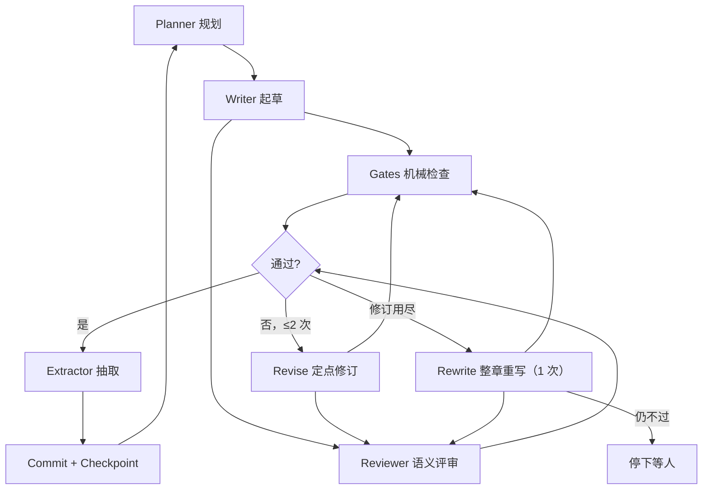

# novel-engine 开发规格 v0.2

> 本版由 v0.1 整理而来：去重、修正内部矛盾（评审见 `docs/25`），
> 与已落地仓库的 11 处差异按「哪个更好用哪个」裁定（见 §0）。
> v0.1 保留作设计背景，**以本文为准**；与 `ne-架构与契约.md` 冲突时，以本文 §0 的裁定为准，并回写契约。

目录：§0 裁定 · §1 架构 · §2 数据模型 · §3 落盘与不变量 · §4 模块 M1–M17 ·
§5 横切 X · §6 内容 C · §7 生命周期 L · §8 前端 W · §9 验收 V

---

## §0 与现仓库差异的裁定

| # | 项 | 采用 | 理由 |
|---|---|---|---|
| 1 | 书数据位置 | **仓库**：每本书独立 `<bookRoot>/`，不入引擎仓 | 引擎与作品解耦，一个引擎多本书，书可单独 git |
| 2 | 门禁状态 | **仓库思路 + 改进**：结论 + 内容指纹，指纹不符即置 null；指纹由 mtime 改为 `contentHash` | mtime 会被复制、touch、时钟误导，hash 不会 |
| 3 | Gates 退出码 | **新统一**：exit 0 = 脚本正常跑完，非 0 = 脚本崩溃；结论只看 stdout JSON | 两边都有缺陷：v0.1 把「内容 fail」和「脚本崩」混在退出码里，仓库 hooks 另立规矩 |
| 4 | Python 解释器 | **仓库**：可配置 `NOVEL_PYTHON`，默认 Windows `python`、其他 `python3` | Windows 实际环境 |
| 5 | 对外函数 | **按模块列公开 API**，放弃「六函数」口号 | 实际已超过六个，口号只会制造矛盾 |
| 6 | Server 路由 | **仓库的路由集** + v0.1 的长任务模型（`202` + SSE） | 路由按需；同步跑长任务会超时 |
| 7 | Server 安全 | **仓库**：回环绑定 + token + bookRoot 白名单 + 写盘默认关 | 更完整 |
| 8 | 返工上限 | 统一常量 `MAX_REVISE = 2`、`MAX_REWRITE = 1`（见 M12.6） | 区分定点修订与整章重写后，总轮数 3 与仓库一致 |
| 9 | Web 引用 core | **v0.1**：允许 `import type`，禁止值导入 | 类型编译期擦除，不引入运行时依赖 |
| 10 | 人工改稿学习 | **仓库**：`feedback.jsonl` + diff → 规则候选，新增采纳命令 | 人工改稿是最有价值的信号，v0.1 缺失 |
| 11 | 后处理/发布 | **仓库**：去 AI 味规则、番茄导出，纳入 M16 | v0.1 缺失 |

### 0.1 作者确认的三条原则（2026-09-25）

1. **逐层递进，层层确认**：定位（交互问答）→ 设定 → 总纲/指南针 → 卷纲（仅当前卷）→ 细纲（仅当前弧）→ 章节。
   每层产物经作者确认后才解锁下一层；上游仍含「待填」时 `preflight` 阻断下游。见 M8.0。
2. **写作流程、约束、提示词沿用当前仓库**：`prompt.ts` 的 system（IDENTITY + canon + rules）、draft/revise 指令、
   rules 文件内容、gates 检查器、收敛循环均保持原样。本文中与之不同的设计（如 M6 九块表）
   **只能以「追加块」方式接入**，不得改写现有块的措辞与顺序；任何对现有提示词文字的修改须单独经作者确认。
3. **长期记忆分两步**：短期先在现有机制上加「当前状态卡」（见 M6.0），Extractor（M5）后置。

---

## §1 总体架构

定位：把「写一本几十万字的书」拆成**可枚举的状态迁移 + 少量语义裁定 + 开放式生成**的 headless 引擎；CLI 与 Web 是两个壳。

### 1.1 主流水线



### 1.2 分层原则

| 原则 | 含义 |
|---|---|
| 事实层确定 | 正文、设定、大纲以文件为唯一真相；JSON 只存索引、摘要，**正文不入 JSON** |
| 派生可重建 | `state/story.json` 丢了能从文件重建；唯一不可重建的是 `feedback.jsonl` |
| 语义层克制 | 只在确实需要判断处调 LLM；LLM 结论必须带可核验的原文证据 |
| 绿只能跑出来 | 任何不经检查就写出「通过」的路径都要堵掉 |
| 可回放 | 每次提交落 checkpoint（含状态快照），LLM 调用可按录像回放 |

core 零 UI 依赖、零运行时依赖；Web 只经 HTTP + SSE 访问 server。

### 1.3 包结构

```
packages/core   headless 内核
apps/cli        命令行（stdout 只吐 JSON/正文，日志走 stderr）
apps/server     node:http 薄服务（HTTP + SSE）
apps/web        Vite + React + TS
gates/          Python 检查器（冻结：只修 bug，新判据写 TS）
tools/          通用工具（导出、标点修复等）
```

---

## §2 数据模型（`packages/core/src/types.ts`）

约束：只用 JSON 可序列化类型——**禁 `Date`/`Map`/`Set`**，时间一律 ISO 字符串，字典用 `Record`。

```ts
// ---- 设定层 ----
export interface Premise { logline: string; themes: string[]; tone: string; }
export interface Compass {
  ending: string;
  mainThreads: string[];
  scale: { volumes: number; chaptersMin: number; chaptersMax: number; wordsMin: number };
  endingVolume: number;
  revision: number;
}

/** 角色状态按章版本化：取「截至第 n 章」的状态用于重写旧章 */
export interface CharacterState {
  realm: string;
  location: string;
  knows: string[];
  ignores: string[];        // 信息边界：悬念来源
  relations: { to: string; kind: string }[];
  alive: boolean;
}
export interface Character {
  id: string;               // 稳定 id：c-<slug>
  name: string;
  aliases: string[];        // 抽取校验用
  role: string;
  voice: { catchphrases: string[]; speechStyle: string };  // 对话口吻，J3 校验
  history: { fromChapter: number; state: CharacterState; cause: string }[]; // 按 fromChapter 升序
}

export interface Foreshadow {
  id: string;               // 由引擎分配：f-<序号>，模型不得自造
  content: string;
  plantedChapter: number;
  targetChapter?: number;
  level: 'minor' | 'major' | 'core';   // core 逾期 → human.needed
  status: 'open' | 'paid' | 'overdue' | 'abandoned';
  paidChapter?: number;
  sourceChapter: number;    // 贡献者，重抽时按章撤回
}

export interface TimelineEvent {
  storyTime: string;
  event: string;
  participants: string[];
  irreversible: boolean;
  sourceChapter: number;
}

export interface GateStatus {
  worst: 'clean' | 'warn' | 'error';
  judgeWorst: 'clean' | 'warn' | 'error' | 'unsure';
  checkedHash: string;      // 检查时刻的 contentHash；与当前不符 → 整个 GateStatus 置 null
  checkedAt: string;
}

export interface ChapterIndexEntry {
  no: number;               // 全书连续序号，唯一排序依据
  file: string;             // 相对 bookRoot，如 chapters/ch-0001.md
  volume: number;
  arcId: string;
  words: number;
  contentHash: string;
  status: 'draft' | 'checked' | 'locked';
  gateStatus: GateStatus | null;   // null = 待检/已过期
  needsReview: boolean;
  reviseCount: number;
  rewriteCount: number;
  generatedBy?: { model: string; promptHash: string; at: string }; // 质量归因
}

export interface StoryIndex {
  schemaVersion: 2;
  characters: Character[];
  foreshadows: Foreshadow[];
  timeline: TimelineEvent[];
  chapters: ChapterIndexEntry[];
  nextForeshadowSeq: number;
  updatedAt: string;
}

// ---- 蓝图 ----
export type HookType = 'suspense' | 'crisis' | 'reversal' | 'reveal' | 'desire' | 'emotion' | 'promise'; // 见 C2
export type PayoffType = string;   // C1 表中的 id
export interface ChapterBlueprint {
  no: number;
  volume: number;
  arcId: string;
  goal: string;
  cast: string[];                  // Character.id
  beats: string[];
  plants: string[];                // 新埋伏笔的内容描述（id 由引擎分配）
  paysOff: string[];               // Foreshadow.id
  payoff: { level: 'none' | 'small' | 'medium' | 'large'; type?: PayoffType };
  hook: { type: HookType; intent: string };   // intent 是意图描述，不做字面比对
  pacing: 'slow' | 'normal' | 'fast';
  targetWords: number;
}

// ---- 运行态 ----
export interface RunState {
  bookId: string;
  phase: 'init' | 'premise' | 'outline' | 'writing' | 'complete';
  flow: 'idle' | 'writing' | 'checking' | 'revising' | 'rewriting' | 'extracting' | 'steering';
  wrapUp: boolean;
  activeChapter?: number;
  pendingCommit?: { chapter: number; checkpointId: string };  // 两步提交标记
  counters: { chaptersWritten: number; revises: number; rewrites: number; llmCalls: number; tokensIn: number; tokensOut: number; costUsd: number };
  startedAt: string;
  updatedAt: string;
}
export interface Checkpoint {
  id: string;                // cp-0007
  createdAt: string;
  run: RunState;
  storySnapshot: StoryIndex; // 完整快照，恢复 = 拷回
  storyHash: string;
  note: string;
}

// ---- 结果 ----
export interface ExtractionResult {
  summary: string;
  characterUpdates: { id: string; changed: Partial<CharacterState>; cause: string }[];
  newForeshadows: { content: string; targetChapter?: number }[];
  paidForeshadows: { id: string; how: string }[];
  timelineEvents: Omit<TimelineEvent, 'sourceChapter'>[];
}
export interface Finding {
  source: 'gate' | 'judge' | 'review';
  code: string;
  severity: 'info' | 'warn' | 'error';
  message: string;
  quote?: string;            // 原文片段；judge/review 必填且须能在正文中命中
  fix?: string;
}
export interface GateResult {
  gate: string;
  ok: boolean;               // 脚本是否正常跑完
  findings: Finding[];
  raw?: string;
  durationMs: number;
}
export interface ReviewResult {
  scores: Record<'structure' | 'character' | 'pacing' | 'prose' | 'foreshadow', { score: 1|2|3|4|5; reason: string }>;
  hardFlaws: Finding[];
  findings: Finding[];
}
export interface FeedbackRecord {
  chapter: number;
  source: 'human-edit' | 'human-metric' | 'review' | 'gate';
  metric: string;
  value: number | string;
  note: string;
  at: string;
}

// ---- 基础设施 ----
export interface Config {
  bookRoot: string;
  llm: { baseUrl: string; apiKey: string; model: string; temperature: number; maxTokens: number; timeoutMs: number };
  agents: Record<string, { temperature?: number; model?: string }>;
  budget: { perChapterUsd: number; perBookUsd: number };
  tokenPerChar: number;      // 中文 token 系数，默认 0.8，按实际 usage 校准
  python: string;
  logLevel: 'debug' | 'info' | 'warn' | 'error';
}
export interface LLMResponse { text: string; usage: { in: number; out: number }; model: string; latencyMs: number; fromReplay?: boolean; }
export interface PromptBundle {
  blocks: { seq: number; kind: 'system' | 'data' | 'instruction'; name: string; text: string; tokens: number }[];
  totalTokens: number;
  truncated: string[];
  hash: string;              // 幂等键组成部分
}
```

---

## §3 落盘与不变量

### 3.1 书目录（`<bookRoot>/`，建议本身是 git 仓库）

```text
.soloent/book.json            书配置（rules/judges/paths 显式声明）
.soloent/feedback.jsonl       人工改稿与指标，唯一不可重建，只追加
book/premise.md  book/compass.md  book/characters/*.md
outline/vol-01.md  outline/arc-v01-a01.md    # 章蓝图在弧文件中，frontmatter 结构化
chapters/ch-0001.md          # 全书连续四位编号，不按卷分目录
summaries/ch-0001.md
anchors/style.md
rules/  rules/_candidates/
state/                       # 可整目录清空重建（checkpoints 除外）
  story.json  run.json  journal.jsonl  .lock
  checkpoints/cp-0007.json
  prompts/  llm/  gates/  decisions/
```

`outline/ch-NN.md`（仓库现用两位）迁移为四位编号，读取时兼容旧名。

### 3.2 不变量（断言 + 回归测试）

| # | 不变量 |
|---|---|
| I1 | `chapters[]` 与 `chapters/*.md` 一一对应，`no` 连续无洞 |
| I2 | `status=locked` ⇒ 有对应 `summaries/`，且 `gateStatus` 非 null、`worst≠error`、`judgeWorst∉{error}` |
| I3 | `open` 且 `targetChapter < 当前章` 的伏笔，下一章蓝图须回收，或自动升 `overdue`；`abandoned` 只能人工设置 |
| I4 | 正常流程中 `phase` 单调；回退只能经显式 `rollback`，并写 journal |
| I5 | checkpoint 的 `storyHash` = hash(`storySnapshot`) |
| I6 | `gateStatus.checkedHash` ≠ 当前 `contentHash` ⇒ 读时置 null（过期好过假绿） |
| I7 | 任何事实（角色历史、伏笔、时间线）都带 `sourceChapter`；重抽第 n 章 = 撤回 n 的全部贡献后再合并 |
| I8 | `state --set` 与 `POST /edit` 不能写入 `gateStatus` |
| I9 | 日志与 `state/llm/*.json` 中不出现 API key |

---

## §4 模块

| # | 模块 | 公开 API（core） |
|---|---|---|
| M1 | 契约层 | 类型、`isValidStoryIndex`、`migrate`、`assertInvariants` |
| M2 | 配置 | `loadConfig`、`paths`、`log` |
| M3 | 事实层 IO | `readCompass`/`readCharacters`/`readBlueprints`/`readChapter`/`writeChapterFile`/`resolveSafe`/`hashContent` |
| M4 | 状态层 IO | `readState`/`writeState`/`rebuildState`/`readRunState`/`writeRunState`/`writeCheckpoint`/`restoreFrom`/`rollback`/`withLock`/`appendJournal` |
| M5 | Extractor | `extract`、`validateExtraction`、`mergeExtraction` |
| M6 | Context Assembler | `buildPrompt` |
| M7 | LLM | `callLLM`、`callLLMStream`、`replayLLM` |
| M8 | Planner | `generatePremise`/`generateCompass`/`generateCharacters`/`expandVolume`/`expandArc`/`generateBlueprints`/`validateOutline`/`reviseCompass` |
| M9 | Writer | `draftChapter` |
| M10 | Gates | `runGates` |
| M11 | Judge + Reviewer | `judgeChapter`（连续性/契约）、`reviewChapter`（审美） |
| M12 | Engine | `generateChapter`、`run`、`resume`、`steer`，事件流 `on(event)` |
| M13 | Arbiter | `decide` |
| M14 | 反馈 | `recordFeedback`、`adoptCandidate`、`stats` |
| M15 | 后处理 | `humanize`（规则化去 AI 味）、`exportPlatform` |
| M16 | CLI | — |
| M17 | Server | — |
| (M18) | Web | — |

v0.1 的 M14 压缩管线**删除**：`buildPrompt` 每次从零组装，不存在「旧消息」；其「恢复包」语义并入 M6（蓝图、Compass、角色块不裁）。

### M1 契约层
| # | 功能 | 验收 |
|---|---|---|
| 1.1 | 全部类型 | tsc 零错误 |
| 1.2 | `isValidStoryIndex` | 坏数据定位到字段路径 |
| 1.3 | `SCHEMA_VERSION=2` + `migrate(1→2)` | 旧 story.json 可迁移 |
| 1.4 | `assertInvariants` | I1–I9 均有单测可触发 |
| 1.5 | 序列化约束 | 单测扫描禁用类型 |

### M2 配置
| # | 功能 | 验收 |
|---|---|---|
| 2.1 | env 读取 | LLM 凭据只走 env，绝不写 book.json；缺失即 fail |
| 2.2 | 分 agent 参数 | 可单独覆盖 temperature/model |
| 2.3 | 路径集中 | 禁止散落拼路径；`resolveSafe` 拦 `..` |
| 2.4 | 日志 | stdout 只放结果，日志走 stderr；自动脱敏 key |

### M3 事实层 IO
| # | 功能 | 验收 |
|---|---|---|
| 3.1 | 读设定/大纲 | frontmatter 解析；蓝图缺必填字段报错，不给默认 |
| 3.2 | 写章节 | 原子写（`.tmp` + rename）；写前核对磁盘现 hash 与预期一致，否则拒写（防覆盖作者手改） |
| 3.3 | 规则显式声明 | 只加载 book.json 声明的 rules；声明缺文件 → `RuleFileMissing`；`auditRules` 报「在但未声明」 |
| 3.4 | `hashContent` | sha256 前 16 位，规范化换行后计算 |

### M4 状态层 IO
| # | 功能 | 验收 |
|---|---|---|
| 4.1 | `readState` | 校验 + I6 过期清扫 |
| 4.2 | `writeState` | 原子写；写前 `assertInvariants`；追加 journal |
| 4.3 | `rebuildState` | 从文件重建索引（事实部分从 summaries frontmatter 回收） |
| 4.4 | 两步提交 | ① 写 checkpoint（含快照）② 写 `run.pendingCommit` ③ 写 story.json ④ 清 pendingCommit；任一步崩溃，`resume` 可判定并补完或回退 |
| 4.5 | `restoreFrom(cp)` | 拷回快照；若当前 story.json 与任何 checkpoint 都对不上，**提示被手改**并要求确认，不静默覆盖 |
| 4.6 | `rollback(cp)` | 显式回退（允许 phase 回退），写 journal；正文文件由书仓 git 回退 |
| 4.7 | `withLock` | 锁文件记 pid + 时间戳；pid 不存在或超 10 分钟视为陈旧锁可接管 |
| 4.8 | 保留策略 | checkpoints 保留最近 50 + 每卷末 1 份；`state/llm` 按天滚动 |

### M5 Extractor
| # | 功能 | 验收 |
|---|---|---|
| 5.1 | 时机 | 判定通过后、commit 前（不与 Gates 并行，未通过的稿不抽） |
| 5.2 | 输入 | 正文 + 出场角色截至上一章的状态 + 开放伏笔列表（带 id） |
| 5.3 | 输出 | 严格 JSON；五字段必填 |
| 5.4 | 防幻觉 | 角色须以 name 或 aliases 命中正文；未命中 → 若与已知角色别名相近则 warn 待人工，否则丢弃；`paidForeshadows.id` 必须在开放列表中 |
| 5.5 | 合并 | 按 I7 先撤回本章旧贡献再合并；新伏笔 id 由 `nextForeshadowSeq` 分配 |
| 5.6 | 人读档案 | 写 `summaries/ch-XXXX.md`，frontmatter 存结构化结果（供 `rebuildState`） |
| 5.7 | 失败降级 | 重试 1 次 → `needsReview`，该章不得 locked |

### M6 Context Assembler（`buildPrompt`）

**M6.0 现状与短期方案（优先于下表）**：现有 `buildPrompt` 结构保持不变——
system = IDENTITY + canon.md + rules；user = 任务 + 细纲 + 写前提醒 + 上一章末 500 字 + 近 2 章摘要 + 关键词相关 2 章摘要（上限 4000 字）。
短期只追加两处：
- 追加块「当前状态卡」：读 `.soloent/memory/now.md`（人物境界/位置/伤势/持有物、未回收伏笔、时间线进度），
  每章提交后由 `summarize` 生成更新**建议**，作者确认后落盘；
- 相关摘要检索的关键词源由「上一章末尾」扩展为「上一章末尾 + 本章细纲中的人名/地名」。

下表为 M5 Extractor 落地后的目标形态，届时仍以追加方式接入。

固定九块，顺序不变；预算按 `tokenPerChar` 估算，超预算按优先级裁：

| 序 | 块 | 预算 | 来源 | 裁剪 |
|---|---|---|---|---|
| 1 | 写作规范 system | 800 | rules（显式声明） | 不裁 |
| 2 | 风格锚点 | 600 | `anchors/style.md`（标注「只学腔调」） | 最后裁 |
| 3 | Compass | 300 | `compass.md` | 不裁 |
| 4 | 本章蓝图 + C1/C2 定义 | 500 | 弧文件 | 不裁 |
| 5 | 出场角色截至上一章的状态（含信息边界） | 1200 | `Character.history` | 先裁关系细节 |
| 6 | 前情摘要（最近 3 章） | 2000 | `summaries/` | 按章压缩 |
| 7 | 结构化反查 | 1500 | 见 6.3 | 减条数 |
| 8 | 上一章末 500 字原文 | 500 | 正文 | 可裁 |
| 9 | 任务指令 | — | draft / revise（revise 附 findings） | 不裁 |

| # | 功能 | 验收 |
|---|---|---|
| 6.1 | 组装与落盘 | `state/prompts/ch-XXXX-<mode>-<n>.txt` 全文落盘 |
| 6.2 | 内容隔离 | 正文/素材包进 data 区；外部参考文本过滤指令式语句 |
| 6.3 | 结构化反查（先不上向量） | 按 cast 查相关伏笔、最近同场景出场、未兑现的 paysOff、相关时间线事件；效果不足再加向量检索 |
| 6.4 | 预算校准 | 每次调用后以 usage 更新 `tokenPerChar` 的滑动均值 |
| 6.5 | 末段指令 | 明确「收在钩子上，不做总结、不补修饰段」 |

### M7 LLM
| # | 功能 | 验收 |
|---|---|---|
| 7.1 | 唯一出口 | core 内只有它发 HTTP |
| 7.2 | 超时 | 超时抛 `LLMTimeoutError` |
| 7.3 | 重试 | 429/5xx 指数退避 + jitter；4xx 直接抛 |
| 7.4 | 熔断 | 连续失败 N 次 → `CircuitOpenError`；重试层 × 轮数有上界 |
| 7.5 | JSON 模式 | 解析失败重试 1 次，仍败带原文抛错 |
| 7.6 | 录像 | `state/llm/` 记脱敏的请求/响应；`replayLLM` 按请求 hash 回放，供离线确定性测试 |
| 7.7 | 计费 | 按模型单价累计 `costUsd`；超 `budget` 抛 `BudgetExceeded`（停下等人） |

### M8 Planner

**M8.0 逐层递进与确认闸门**

| 层 | 形式 | 产物 | 解锁条件 |
|---|---|---|---|
| 1 定位 | 交互问答（题材、平台、目标读者、主角与金手指、基调/文风、篇幅、对标书） | `book.json` 的 book 段 + `book/premise.md` | 作者确认 |
| 2 设定 | LLM 起草 + 作者改 | `canon.md`（世界观、力量体系、势力）、`book/characters/*.md`、`anchors/style.md` | 作者确认，无「待填」 |
| 3 总纲 | LLM 起草 2 版供选 | `book/compass.md`、`outline/总纲.md` | 作者确认 |
| 4 卷纲 | 仅当前卷 | `outline/vol-XX.md` | 作者确认 |
| 5 细纲 | 仅当前弧，逐章蓝图 | `outline/ch-XXXX.md` 或弧文件 | 作者确认 |
| 6 章节 | 现有 write/generate 流程 | `chapters/` | — |

每层确认记入 `state/run.json` 的 `confirmed` 列表；回改上层时，下层相关产物标「待复核」，不自动重写。

| # | 功能 | 验收 |
|---|---|---|
| 8.1 | 前提 | `premise.md` + 2 个备选，人选定 |
| 8.2 | 指南针/角色 | 生成后人可改；角色写 md + 初始 history |
| 8.3 | 滚动展开 | **一次只展下一卷**；远卷只留一行标题，禁止空壳蓝图 |
| 8.4 | 蓝图 | `payoff.level`、`hook.type`、`pacing` 必填；`hook.type` 近 5 章重复 ≥3 次时 warn（C2.3） |
| 8.5 | 自检 | 蓝图引用的角色、伏笔 id 必须存在 |
| 8.6 | 卷边界 | 先 `reviseCompass`（基于已写档案），再 `expandVolume`，顺序不可反 |

### M9 Writer
| # | 功能 | 验收 |
|---|---|---|
| 9.1 | 起草 | 默认**整章一次生成**；超出单次输出上限时才分段（段 2+ 注入前段末 300 字，顺序生成） |
| 9.2 | 幂等 | 键 = hash(蓝图 + `PromptBundle.hash` + 模型 + 段号)；命中直接复用已存草稿 |
| 9.3 | 字数 | 偏离 `targetWords` > 30% 记 warn |
| 9.4 | 不写状态 | 只产草稿文件；状态由 Engine 提交 |
| 9.5 | 失败 | LLM 失败不落盘、不改 state |

### M10 Gates（机械规则）

协议：`argv[1]` = 章节 md 路径；stdout = 单个 JSON `{findings: Finding[]}`；stderr 随意；
**exit 0 = 正常跑完，非 0 = 脚本崩溃**（记 `ok:false`，不当作内容结论）。

| # | 功能 | 验收 |
|---|---|---|
| 10.1 | 注册表 | book.json 显式声明启用哪些检查器 |
| 10.2 | 并发 + 超时 | 硬超时后杀进程树；失败回显 stderr 前几行 |
| 10.3 | 零结果 ≠ 通过 | 检查器未运行或输入为空 → 不产生 clean |
| 10.4 | 内容层断言 | 空章、极短章直接 error |
| 10.5 | 范围 | **只做可字面判定的事**：字数、禁用词、标点、数值格式、名字写法；钩子/伏笔/连续性不归这里 |
| 10.6 | 字面钩子校验 | `hooks.ts` 保留为只读线索报告，不计入结论 |

### M11 Judge 与 Reviewer（语义层，两个独立 prompt）

**Judge（契约与连续性，决定能否提交）**

| 判据 | 输入 | 判什么 |
|---|---|---|
| J1 蓝图契约 | 正文 + 蓝图 | goal 是否达成、beats 覆盖、paysOff 是否兑现、plants 是否埋下 |
| J2 章末钩子 | 正文末 800 字 + `hook` | 是否以 `hook.type` 所述方式收尾（按意图判定，不比字面） |
| J3 连续性 | 正文 + 出场角色截至上一章的状态 + 上一章摘要 + 相关时间线 | 与已发生事实冲突（伤势、境界、生死、地点、信息边界穿帮） |

输出每条 `{criterion, verdict: pass|fail|unsure, quote, reason}`；
`quote` 在正文中找不到 → 该条降为 `unsure`。`fail` 计 error，`unsure` 不计通过也不拦截，进人工清单。温度 0.2。

**Reviewer（审美，影响修订但默认不拦截）**

五维 1–5 分 + 理由：结构 / 角色 / 节奏 / 文笔 / 伏笔手法；意见必须带 `quote`，否则丢弃。
不喂全书摘要（连续性已由 J3 负责）。任一维 ≤2 触发修订；阈值集中在一个常量文件。

Gates 与 Judge/Reviewer **不查同一项**（见 M10.5）。

### M12 Engine

一章的周期：`draft → (Gates ∥ Judge ∥ Review) → 判定 → [revise ≤2 | rewrite ≤1] → Extract → 两步提交`

| # | 功能 | 验收 |
|---|---|---|
| 12.1 | 判定 | 阻断 = Gates error 或 Judge fail；Review 低分只触发修订 |
| 12.2 | 修订优先 | 先按 findings 定点修订（`MAX_REVISE=2`），再整章重写（`MAX_REWRITE=1`），仍不过 → `needsReview` 停下 |
| 12.3 | 状态机 | Phase 正常流程单调；Flow 仅 writing 期可切，`assertTransition` 按下表 |
| 12.4 | 恢复 | `resume` 读 `pendingCommit` 判定补完或回退；草稿半成品丢弃重来（幂等键避免重复计费） |
| 12.5 | 卷边界 | 写完一卷 → 人工确认点 → `reviseCompass` → `expandVolume` |
| 12.6 | Steering | 指令落 `state/decisions/`，只在章边界生效 |
| 12.7 | 并发编辑 | commit 前复核正文 hash；与草稿不一致（作者手改过）→ 以磁盘为准，重跑检查 |
| 12.8 | 事件 | 见下表；CLI 打印、server 转 SSE 用同一套 |

| Phase | 允许 Flow |
|---|---|
| init / premise / outline / complete | idle |
| writing | 全部 |

| 事件 | 时机 |
|---|---|
| `chapter.started` | 开始写某章 |
| `draft.delta` | 流式文本片段 |
| `checks.done` | Gates + Judge + Review 汇总 |
| `revise.started` | 进入修订/重写 |
| `chapter.committed` | 提交成功 |
| `checkpoint.written` | 写入存档 |
| `human.needed` | 撞闸门/超预算/低置信（附原因） |
| `error` | 系统错误 |

### M13 Arbiter
| # | 功能 | 验收 |
|---|---|---|
| 13.1 | 封闭题型 | `pick-strategy` / `blast-radius` / `escape-route` / `assign-payoff`，候选集由 Engine 给全 |
| 13.2 | 默认人工 | 默认这四类都交人；开启自动后才调 LLM |
| 13.3 | 自洽采样 | 同题采样 3 次，不一致 → `human.needed`（不用模型自报置信度） |
| 13.4 | 只选不写 | 绝不生成正文 |
| 13.5 | 落盘 | `state/decisions/d-XXXX.json` |

### M14 反馈
| # | 功能 | 验收 |
|---|---|---|
| 14.1 | 人工改稿 | `feedback add` 追加 `feedback.jsonl`，行级 diff 聚合规则候选到 `rules/_candidates/` |
| 14.2 | 候选采纳 | `rules adopt <id>`：移入 `rules/`、写入 book.json 声明、追加采纳记录 |
| 14.3 | 平台指标 | 追读率/完读率人工录入，只存事实 |
| 14.4 | 统计 | `stats`：每章修订/重写次数、findings 数、人工改稿行数、Judge 通过率、成本；北极星 = 人工改稿行数/千字 |

### M15 后处理与发布
| # | 功能 | 验收 |
|---|---|---|
| 15.1 | 去 AI 味 | 规则化替换 + 可选 LLM 润色（润色后须重跑 Gates） |
| 15.2 | 标点/格式 | 复用 `tools/fix_punctuation.py` |
| 15.3 | 平台导出 | 番茄 TXT 等，复用 `tools/export_fanqie_txt.py` |
| 15.4 | 敏感词 | 平台敏感词表作为 Gate（error），词表按平台配置 |

### M16 CLI

沿用现有命令（init/write/generate/prompt/preflight/gates/state/summarize/rules audit/hooks/feedback add/book），新增：
`plan premise|compass|volume N`、`run [--until N]`、`resume`、`steer "<指令>"`、`judge --chapter N`、`review --chapter N`、`rules adopt`、`stats`、`export --platform fanqie`。

退出码：`0` 成功 / `1` 内容未通过 / `2` 环境或参数错误 / `3` 需要人工介入。`hooks` 等只读报告恒为 0。

### M17 Server

沿用现有路由；新增 `POST /run`（立即返回 `202 {runId}`）、`GET /events`（SSE，支持 `Last-Event-ID` 补发）、`POST /steer`、`POST /edit`（统一写入口，服务端校验，禁止写 gateStatus）。
安全：只绑 127.0.0.1、token 鉴权、bookRoot 白名单、写盘默认关闭；与 CLI 共用 M4.7 文件锁。

---

## §5 横切 X

| # | 项 | 规定 |
|---|---|---|
| X1 | 成本 | 单章、全书预算；超限 `human.needed`；`stats` 展示 |
| X2 | 日志 | stderr 结构化；key 脱敏；`state/llm` 滚动清理 |
| X3 | 锁 | 见 M4.7 |
| X4 | 安全 | 见 M17；prompt 注入隔离见 M6.2 |
| X5 | 版本 | 书目录建议 git；每次 commit 可选自动 `git commit`（消息含章号与 checkpoint id） |
| X6 | 测试 | core 单测；CLI 用子进程跑 dist 做冒烟；LLM 模块用 `replayLLM` 离线测试；Python gates 用 pytest 固件 |
| X7 | 评测集 | 固定 10 章「蓝图 + 人工好稿」；改 prompt/规则/模型必跑，对比 Judge 通过率与人工盲评 |
| X8 | 可观测 | 每章 `generatedBy` 记模型与 prompt hash，质量回退可归因 |

---

## §6 内容 C（爽点与钩子枚举）

> 状态：**v1 草案，先以「建议」方式接入，不作硬拦截**。
> 来源：网文通行创作经验整理，并参考仓库 `content/skills/golden-three-chapters-review`、
> `wuhang-long-chaijie2`（断章钩子分析）、`trope-retrieval`。联网调研本次不可用，待校准。
> 接入方式：蓝图必填 `hook.type`，`payoff.type` 可选；Judge J2 按 `hook.type` 判收尾；
> 爽点类型只供 Planner 分配与 Reviewer「节奏」维参考。跑完一卷后用 `stats` 数据校准本表。

### C1 爽点类型

| id | 名称 | 核心机制 | 典型写法 | 常见失败 |
|---|---|---|---|---|
| `face-slap` | 打脸 | 轻视者被事实反驳 | 铺垫嘲讽 → 主角展示 → 旁观者反应 | 反派降智；铺垫不足导致不解气 |
| `underdog` | 扮猪吃虎 | 信息差：读者知、角色不知 | 隐藏实力 → 被低估 → 揭示 | 隐藏动机不成立 |
| `level-up` | 突破/升级 | 可量化的成长 | 瓶颈 → 契机 → 突破 → 新能力展示 | 只报数值、没有展示 |
| `gain` | 获得/奇遇 | 资源陡增 | 线索 → 冒险 → 收获 → 用途预告 | 来得太容易 |
| `reversal` | 逆转翻盘 | 绝境反杀 | 压到最低 → 伏笔兑现 → 反转 | 反转无伏笔，像开挂 |
| `recognition` | 身份揭露/被认可 | 地位跃迁 | 众人误解 → 身份曝光 → 态度翻转 | 只写旁人震惊，缺主角行动 |
| `revenge` | 复仇/清算 | 积怨释放 | 前账回顾 → 对峙 → 清算 | 积怨铺垫太短 |
| `crush` | 碾压 | 实力差展示 | 对手放狠话 → 一招结束 | 连续使用导致疲劳 |
| `outsmart` | 智斗/算计 | 布局被揭晓 | 读者见局 → 对手入局 → 揭晓 | 计谋依赖对手犯蠢 |
| `harvest` | 收获/经营成果 | 长期投入见效（种田、经营类） | 投入 → 等待 → 成果展示 → 他人反应 | 缺少数字或对比 |
| `bond` | 情感兑现 | 关系推进 | 误会/守护 → 表白、和解、并肩 | 情感跳跃 |
| `justice` | 惩恶/护短 | 道德满足 | 欺凌 → 主角出手 → 恶有恶报 | 说教 |

`payoff.level` 与类型正交：`small` 每 1–2 章、`medium` 每 3–5 章、`large` 每卷 2–3 次（建议值，由 `stats` 校准）。

### C2 章末钩子类型

| id | 名称 | 收尾方式 | 例（意图） | Judge 判定要点 |
|---|---|---|---|---|
| `suspense` | 悬念 | 抛出未解问题 | 门后站着一个本该死去的人 | 末段引入新疑问，且本章未解答 |
| `crisis` | 危机 | 停在危险临界点 | 刀已落下 | 危险在末段出现或升级，结局未定 |
| `reversal` | 反转 | 颠覆刚建立的认知 | 盟友才是幕后黑手 | 末段信息与前文认知相反 |
| `reveal` | 揭示 | 给出关键信息的一半 | 「那个人的名字是……」 | 揭示了部分，留下更大的问题 |
| `desire` | 期待 | 预告即将到来的爽点 | 比武明日开始 | 明确的下一步事件，读者有期待 |
| `emotion` | 情绪 | 停在强情绪峰值 | 她终于哭出声 | 末段情绪强度为本章峰值 |
| `promise` | 承诺/立誓 | 角色立下目标 | 「三个月后，我会亲手拿回来」 | 明确的目标与期限 |

**C2.1 通用禁忌**（Judge J2 直接判 fail）：以总结、感慨、「众人散去」「一夜无话」收尾；钩子在本章内已被解答。
**C2.2 与爽点配合**：`large` 爽点章优先用 `desire`/`suspense` 接续，避免爽完即平。
**C2.3 多样性**：近 5 章同一 `hook.type` ≥3 次 → Planner warn。

### C3 不实现项（本版）

- 爽点「强度」自动打分：无可靠判据，先不做。
- 以爽点类型做硬拦截：只作建议，数据足够后再议。

---

## §7 生命周期 L

| # | 主题 | 规定 |
|---|---|---|
| L1 | 两级状态机 | Phase 宏观、正常单调；Flow 仅 writing 期切换；错误和外部信号不改 Phase |
| L2 | 收尾 | 当前卷 = `Compass.endingVolume`，或字数 ≥ `scale.wordsMin`，或非 abandoned 伏笔全部 paid → 置 `wrapUp=true`：生成结局弧蓝图 → 逐条核对未回收伏笔 → 写结局 → 全书一致性扫描 → `complete` |
| L3 | 设定变更 | 影响分析（按 `sourceChapter` 反查引用章）→ 人工圈定 → 从最早章顺序定点重写（用该章之前的角色状态）；不做全局自动重写 |
| L4 | 中断恢复 | 草稿半成品丢弃；检查已跑完未提交则重跑（幂等）；提交中崩溃由 `pendingCommit` 判定；大纲半成品丢弃重展 |
| L5 | 人工介入点 | 修订/重写用尽、Judge `unsure` 清单、Arbiter 采样不一致、伏笔放弃、设定变更、卷边界确认、预算超限 |
| L6 | 卷边界 | 先修指南针，再展下一卷（M8.6） |

---

## §8 前端 W

| # | 规定 |
|---|---|
| W1 | 前端不持有业务状态：不判定、不拼 prompt、不决定下一章 |
| W2 | 首屏 `GET /state` 拉全，之后靠 SSE 事件触发重拉；刷新即丢弃本地状态 |
| W3 | `draft.delta` 增量追加，不整章重渲染；流式缓冲放 `useRef` + 节流 |
| W4 | 编辑一律走 `POST /edit`：改正文 → 重跑检查与抽取；改蓝图 → 只影响未写章；改设定 → 走 L3；改风格锚点 → 下一章生效 |
| W5 | diff 与回滚：依赖书仓 git + `rollback(cp)`，前端只做展示与触发 |
| W6 | 状态分三层：服务端真相（不进 React state）/ 会话态 / 流式缓冲 |
| W7 | Vite + React + TS；一个 `useRunEvents()` hook + `useReducer`，不上大型状态库 |
| W8 | 降级：SSE 自动重连（带 `Last-Event-ID`）→ 3 次失败降级 5 秒轮询 → 服务端不可达则标灰显示最后已知状态 |
| W9 | 视图：时间轴（主）/ 阅读器 / 状态面板 / 人工介入清单 / Findings 面板（点击跳到原文 quote） |
| W10 | 章节列表虚拟滚动 |

---

## §9 验收 V

| 档位 | 判定 | 最小闭包 |
|---|---|---|
| 单章能出 | 蓝图 → 可读章节，Gates 无 error、Judge J1/J2 通过 | M1–M7、M9–M11、M8（到蓝图） |
| 一卷能续 | 连续 20–40 章，J3 无 fail、伏笔逾期 = 0、可中断恢复 | + M12、M13、M14、L1、L4 |
| 一本能收 | 完本，伏笔闭环，全书一致性扫描通过 | + L2、L3、L5、L6、M15 |

| 质量指标 | 目标 | 度量 |
|---|---|---|
| 连续性 | J3 fail = 0（抽检确认） | Judge + 人工抽检 |
| 钩子 | J2 通过率 ≥ 90% | Judge |
| 伏笔 | 逾期 = 0 | 状态统计 |
| 篇幅 | 单章偏离 ≤ 30% | M9.3 |
| **北极星** | 人工改稿行数/千字 持续下降 | M14.4 |
| 成本 | 单章 ≤ 预算 | X1 |

---

## 附 A：吸收《AI小说生成系统开发文档.docx》的部分

该文档是面向多用户 SaaS 的通用方案（LangGraph + FastAPI + PostgreSQL/Neo4j/Qdrant + K8s），
整体架构与本项目「单用户、文件为真相、TS headless」路线不符，**不采纳其技术栈**；以下点子采纳：

| 来源 | 采纳内容 | 落点 |
|---|---|---|
| 人物档案字段 | `Character` 增加 `voice: { catchphrases: string[]; speechStyle: string }`，J3 校验对话口吻 | §2、M11 |
| 伏笔等级 | `Foreshadow.level: 'minor' \| 'major' \| 'core'`，core 伏笔逾期直接 `human.needed` | §2、I3 |
| 局部重写 | 修订按 `quote` 定位段落只重写该段，而非整章重生成 | M12.2 |
| 查重 | 章内/跨章重复片段检测作为 Gate（n-gram，warn） | M10 |
| 轻量模型分工 | `config.agents` 中摘要、抽取、初筛可配小模型 | M2.2、X1 |
| 文风样稿提炼 | 上传样稿 → 提炼风格摘要 + few-shot 段落写入 `anchors/style.md` | M8 |
| 一致性基准 | 构造「故意植入设定冲突」的章节集，度量 J3 检出率 | X7 |
| 完结报告 | 伏笔回收率、成长线完整性报告 | L2 |
| 参考项目 | Word Compiler（三环上下文）、SAGA（状态机+图）、StoryWriter、DeepWriter-Bench，作为 M6/X7 的调研对象 | — |

不采纳：LangGraph/Celery/三库存储/多租户 JWT/K8s（规模不匹配）；「修改设定同步全量记忆库」（与 L3 人工圈定冲突）；
LoRA 风格微调（成本高，先用 few-shot）；「检出率 ≥95%」等未经基准验证的指标。

## 附 B：从当前仓库到 v0.2 的迁移顺序

1. schema v1→v2：`gateStatus` 指纹改 hash、加 `needsReview`/计数、角色 history、伏笔 `sourceChapter`（M1.3）
2. Gates 退出码语义统一（M10）
3. Judge J1–J3（对应 docs/24 P0-1）+ 修订优先的收敛（M12.2）
4. 两步提交 + 快照 checkpoint + resume（M4.4、M12.4）
5. Extractor + 结构化反查（M5、M6.3）
6. `replayLLM` + CLI 冒烟测试（X6）
7. Planner 滚动展开、C1/C2 接入（M8、§6）
8. SSE 长任务、`/edit`、Web 视图（M17、§8）
9. stats、rules adopt、后处理与发布（M14、M15）
